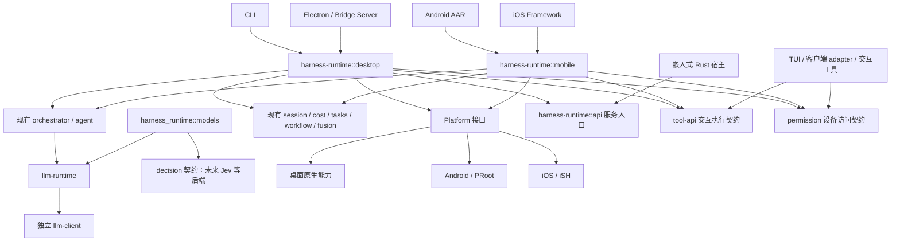

# LingXi Harness 架构

运行时已迁入独立 `lingxi-coder/harness-runtime` 仓库；本仓库通过固定 Git 提交接入。源码与资源归属、验证边界和维护方式见 [独立仓迁移记录](harness-runtime-extraction.md)。以下组件与行为边界继续适用。

## 重构原则

本次工作以现有完整产品实现为基线。移动原代码、明确组件归属、收敛依赖和装配入口；不重新实现 Agent 循环、权限系统、模型调用、会话恢复或持久化。

此前整体方案中的新 SQLite 状态服务、新执行状态机和统一调度器不在本次结构重构中启用。现有会话与费用存储继续由原实现管理，不切换数据根、不迁移或删除用户数据。后续若替换这些实现，必须作为独立的行为变更评估。

现有产品能力和各端能力差异保持不变；旧的 `engine-desktop` / `engine-mobile` crate 已由新的装配模块替代，所有仓库内调用方同步更新，不保留旧 crate 的转发包装。

## 组件与依赖

### harness-runtime::api 与领域契约

SDK 公共服务直接位于 `harness-runtime::api`，包含 `HarnessBuilder`、`Harness`、`SessionHandle`、会话与生命周期服务接口。独立的 `harness-api` crate 已移除。

底层共享契约按职责归属：

- `tool_api::ask_user_question`：结构化提问及单次响应通道。
- `tool_api::bash_runner`：通过既有权限和沙箱路径执行交互命令的接口。
- `permission::computer_access`：设备访问请求、授权结果及响应通道。

这些定义保留原字段、响应语义和已有测试。工具、TUI 与客户端 adapter 依赖领域契约，不能反向依赖 `harness-runtime`；Runtime 负责装配这些组件。旧 crate 和旧模块路径不提供兼容转发。

### harness_runtime::models 与 llm-runtime

模型 SDK 入口收在 `harness_runtime::models`，不再设置独立 `model-runtime` crate。现有 `agent` crate 保持 Agent 执行内核职责，不改名为 `llm-runtime`；Agent 上下文、工具回合和停止条件与模型调用分别归属。Agent、orchestrator、compaction 等底层组件直接依赖 `llm-runtime`，不能为了使用模型反向依赖 Harness 装配层。当前 Decision 只有能力契约，作为 SDK 的公开模块保留，不增加空的 `decision-runtime` crate：

- `llm`：直接公开现有 `llm-runtime`。账户、路由、认证、重试、流式事件、费用和提供商处理仍执行原代码。SDK 调用方可以使用此入口；底层组件直接使用 `llm_runtime`。
- `decision`：独立的结构化决策契约，预留 Jev 等非聊天模型。定义状态修订号、具名问题、是非概率、选择和评分结果，以及取消与超时上下文。

决策契约只验证输入输出对应关系及数值范围，不注册真实后端、不发送请求、不改变现有 Fusion 或权限分类器。缺失的概率、置信度和用量保持缺失。调用策略负责判断状态是否仍有效以及预测是否允许用于后续动作。

模型角色与后端分离：主模型、摘要、仲裁等属于业务用途；对话和结构化决策属于能力接口。未来接入新能力时增加自己的类型化接口，不将其强制转换为聊天请求。若底层执行组件需要使用非 LLM 契约，应将契约下沉到对应领域组件，不能反向依赖 Harness 装配层。

### harness-runtime

共享 SDK 与产品装配入口。其组件仍由已有 crate 实现：

| 组件 | 现有实现的职责 |
|---|---|
| orchestrator / agent | 主会话与子 Agent 执行 |
| session / memory / compaction | 历史、恢复、记忆与上下文压缩 |
| permission / hooks | 权限与生命周期 Hooks |
| tasks / coordinator / workflow / fusion | 后台任务、协作与编排 |
| tool-api 与各工具 crate | 工具定义、注册与执行 |
| llm-runtime / harness_runtime::models | LLM 执行服务 / SDK 模型入口和决策契约 |
| client-adapter / client-protocol | 客户端命令、事件与 DTO 转换 |
| platform-api 与 platforms | 宿主系统和工具执行环境 |

`desktop` 模块承接原桌面装配的全部代码，`mobile` 模块承接原移动装配的全部代码。它们是同一 SDK 内的产品配置，不是新建的 Agent 内核。平台选择、工具集合、状态所有权和关闭顺序沿用原实现。

移动端运行逻辑由 `mobile` feature 启用。`uniffi` 只在其上增加外部绑定、类型元数据和回调支持；嵌入式 Rust 宿主不需要启用 UniFFI 即可使用移动装配。

SDK 默认启用 `core`；`fusion`、`workflow`、`collaboration` 按需公开既有功能组件。桌面和移动配置显式启用其原有依赖和工具特性，避免由其他平台的 feature 合并意外提供能力。

嵌入式 Rust 入口由 `HarnessBuilder`、`Harness` 和 `SessionHandle` 提供，公共操作只使用模型无关的输入、既有会话类型和取消信号。`SessionService`、`LifecycleService` 通过显式注入绑定已有执行与关闭实现；`desktop::build_harness` 直接调用原桌面装配，接受宿主输出与权限接口。SDK 不新增执行循环、存储或恢复机制。现有客户端装配仍负责产品命令和绑定协议。

凭据目录刷新由 `SharedCredentialStack` 所有的 `FusionCatalogRegistry` 管理，并显式传递到登录、退出和客户端凭据写入路径。独立构造的作用域互不通知；共享作用域必须显式克隆同一 registry。刷新列表不再保存在进程级静态变量中。

## 宿主与交付

| 宿主 | 装配入口 | 保留的系统边界 |
|---|---|---|
| CLI | `harness_runtime::desktop` | 终端、信号、原生进程与凭据 |
| Electron / Bridge Server | `harness_runtime::desktop` | RPC、Credential Broker、设备与音频桥接 |
| Android AAR | `harness_runtime::mobile` | Android Platform、PRoot、Keystore、原生回调 |
| iOS Framework | `harness_runtime::mobile` | iOS Platform、iSH、Keychain、原生回调 |

Android 与 iOS 的平台构造仍在其包装 crate 中。Linux 环境保持工具执行后端的角色，模型通信、会话状态及凭据仍由原生 Rust 与宿主能力管理。

UniFFI 的共享运行时命名空间随 crate 迁移改为 `harness_runtime`。原生绑定、保留规则、iOS 头文件探针和资源打包脚本同步采用这一名称；不混用旧生成绑定和新库。

Local Apps 的资源编译器、inventory、模板和供应链检查随代码迁移重新定位。内容摘要和资源字节保持原值。

## 依赖约束

- `harness-runtime`、`llm-runtime`、`tool-api` 与 `permission` 不直接或间接依赖 `tui` 或 `tui-core`。
- 产品入口可以依赖 `harness-runtime`；底层组件不得反向依赖装配入口。
- 平台实现和工具保持既有依赖约束；模型提供商通信继续由独立 `llm-client` 完成。
- 客户端显示派生由 `client-presentation` 共享，`client-adapter` 与终端共同使用迁出的原实现；终端 I/O 和主题自动检测仍留在 `tui-core`。

依赖检查由 `scripts/checks/check_deps.py` 执行。

## 验证要求

1. 迁移前先验证现有桌面、移动、Android AAR、iOS Framework 的编译基线。
2. 分别验证 SDK 核心配置、没有 UniFFI 的移动配置，以及全部原生与 RPC 入口。
3. 原装配单元测试、工具集合快照、会话/费用测试、权限与 shell 门控测试直接迁移并继续运行。
4. 验证决策契约拒绝错配的问题、未知选项、过期状态版本和非法概率，并保留缺失统计。
5. 核对 Local Apps 资源 inventory、供应链检查和原生绑定生成。
6. 构建检查、宿主测试、模拟器及真机验证分别报告；一项通过不代表其他验证已完成。

本次不以更换存储、重建功能、模拟模型后端或未接入的抽象来代替架构重构。

本次编译、测试、原源码对照及尚未覆盖的验收场景见 [验证记录](harness-runtime-verification.md)。
