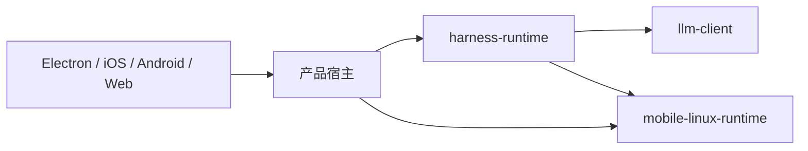

# 多仓开发与 SDK 独立性

将相关 checkout 放在 `~/lingxi/`，使编辑器和终端容易同时打开它们；每个仓库仍独立维护源码、提交、工具链、锁文件和发行。`~/lingxi/` 是开发目录，不建立覆盖所有 SDK 的 Cargo workspace、Git 仓库或产品子模块树。

## 目录和职责

```text
~/lingxi/
├── lingxi-app/          # 产品宿主：CLI、TUI、Bridge、移动 FFI、客户端、签名与发行
├── harness-runtime/     # 会话、编排、工具、权限、记忆与运行时组装
├── llm-client/          # provider 协议、传输、文件、模型目录、用量与价格
├── mobile-linux-runtime/ # Linux API、平台实现、FFI、PTY 与原生资源
└── computer-user/       # 当前只有 README / LICENSE，尚未接入产品依赖图
```

产品 Rust workspace 位于 `lingxi-app/Cargo.toml`，8 个成员按产品职责分布于 `apps/`、`packages/` 和 `tools/`；平台界面与 FFI 在同一产品目录内，npm / PyPI 发行包装位于 `packaging/`。迁移应保留完整产品 checkout，包括 `.git`、未提交和未跟踪文件、已初始化的参考子模块及仍需使用的构建产物。迁移不会将仓库外的用户会话、Keychain 凭据或应用数据搬进源码目录。

Fusion 评测语料归运行时仓库的 `evals/fusion/`。本次移入 Harness main 提交 `cabc6b954f06c70310bc53579fc0420e9b9dda0c`，从产品父提交 `88ab239c2a3953a6e85c9166a0e729fea5751f25` 逐文件保留 73 个文件的原始字节，包含 24 个任务和 48 个 grader。产品删除旧副本，运行时维护唯一权威版本；语料迁移不改变产品固定的 SDK revision，也不执行付费评测。

### 产品源码布局

产品仓库采用 `lingxi-app` 名称，表达它是 SDK 的产品消费者和多端应用装配层。`Next` 属于开发阶段标签，不适合作为长期仓库边界；产品显示名称、发行包名、应用标识和签名配置继续按各自的产品契约维护。

```text
lingxi-app/
├── Cargo.toml / Cargo.lock    # 产品 Rust workspace 和固定上游来源
├── apps/
│   ├── electron/             # 桌面界面、原生 helper 与签名打包
│   ├── ios/
│   │   ├── native/           # SwiftUI 与 Xcode 工程
│   │   └── ffi/              # ios-framework Rust 包
│   ├── android/
│   │   ├── native/           # Kotlin 与 Gradle 工程
│   │   └── ffi/              # android-aar Rust 包
│   ├── cli/
│   │   ├── host/             # cli Rust 包
│   │   ├── tui/              # tui Rust 包
│   │   └── tui-core/         # tui-core Rust 包
│   ├── bridge-server/        # 跨客户端 Rust Bridge 入口
│   └── web/                  # Web 界面
├── packages/
│   ├── bridge-client/        # @lingxi/bridge-client TypeScript 协议客户端
│   └── config-requirements/  # Rust 产品配置要求
├── tools/ios-use/            # Rust iOS 控制工具
├── resources/
│   ├── voice/                # 共享语音配置、模型目录与生成器
│   └── translations/         # 共享翻译源与生成器
├── build-support/            # 共用 Git 构建元数据
├── packaging/                # CLI 的 npm / PyPI 包装
├── assets/brand/             # 品牌设计源
├── scripts/、.github/        # 来源检查、构建、CI 和发行入口
└── docs/                     # 当前指南、设计提案和历史记录
```

根 Cargo workspace 继续维护 8 个成员：`apps/cli/host`、`apps/cli/tui`、
`apps/cli/tui-core`、`apps/bridge-server`、`apps/ios/ffi`、`apps/android/ffi`、
`packages/config-requirements` 和 `tools/ios-use`。移动 FFI 仍通过显式 Cargo
包选择构建；平台 UI 通过自己的 Xcode、Gradle 或 npm 工程迭代。目录归并不会
把 Rust、Swift、Kotlin 和 TypeScript 合成一个包，也不会改变 SDK 的独立测试边界。

`packages/bridge-client` 是产品的 TypeScript 协议客户端，Electron 通过
`file:../../packages/bridge-client` 消费编译后的 `dist/`。它目前仍是产品内的
private 包；移到 `packages/` 不表示已独立发行。独立发行前需明确版本与协议兼容规则。

### 本地目录整理

独立参考仓 `claude-code`、`codex` 位于 `~/lingxi/.references/`，历史 `lingxi-code` 副本位于 `~/lingxi/.local-state/lingxi-app/legacy/`，`codegraph-out`、`claude-code-graphify` 位于其 `graphs/`，`output`、`backups` 位于其同名目录。此次重命名与整理记录在 `~/lingxi/.migration/2026-09-29-product-rename.json`，此前的目录迁移清单保持为历史记录。

当前仍使用的 `.codegraph/`、`.claude/`、`.claire/` 及运行时状态留在产品根目录，Rust / npm / 平台构建缓存及客户端签名产物随各平台目录完整保留在新布局中。各 SDK 的主 checkout、工具链与锁文件仍由其自身维护。

源码依赖方向如下，箭头表示消费 SDK：



LingXi 直接消费 Mobile Linux API、iOS 适配和桌面 PTY。SDK 应通过公共 Rust API、协议、FFI 或资源契约提供能力，避免引入产品 crate、客户端 UI、签名账号和产品持久化路径；产品选择能力、装配生命周期并拥有客户端配置。`computer-user` 的同目录位置不代表已有运行时集成。

目前 LingXi 还直接依赖 Harness 的多个内部包，目录分开之后仍存在架构耦合。后续应逐步把产品消费收敛到明确的运行时 facade 和稳定的客户端 / 平台契约，内部包重组由 Harness 独立完成；每次收敛都需要验证宿主生命周期、持久化和平台行为，不能只靠搬目录完成。

## 迁移时的来源基线

2026-09-29 迁移开始时的来源如下。这是核对记录，后续升级以各仓库 manifest、锁文件及 Git 状态为准。

| 消费关系 / checkout | 提交 |
|---|---|
| LingXi 固定的 Harness | `617c5bdf4f98db43a3f897a7d23b24c220368145` |
| LingXi 和 Harness 固定的 Mobile Linux SDK | `224f1fb1fd0f24b5e138c9095e22a6c20b375eb1` |
| Harness 固定的 LLM SDK | `58740df6606d5eafa1b575fde2af940278f11d0b` |
| `~/lingxi/harness-runtime` checkout HEAD | `a7dce30bf9fcc71617fd4a1acf3cd29e84b98f78` |
| `~/lingxi/llm-client` checkout HEAD | `1a60e73ad12e663be768232a91cbd3ea693aca6e` |
| `~/lingxi/mobile-linux-runtime` checkout HEAD | `eeab57459c5a4e78e5f20b321c70c7ad550309d8` |

三个 SDK checkout 的 HEAD 都不同于产品当前消费的提交；只移动目录不会改变产品行为，也不应顺便升级固定版本。

Harness 本仓根 manifest 为独立测试配置了指向 `deps/llm-client` 的 `[patch]`，迁移开始时该子模块尚未初始化。需要在 Harness 仓运行以下命令取得它记录的提交：

```sh
git -C ~/lingxi/harness-runtime submodule update --init --recursive
```

这个子模块与相邻 `~/lingxi/llm-client` 是不同 checkout。相邻仓的改动不会自动被 Harness 或 LingXi 使用；Harness 根的 patch 也不会自动传递到 LingXi 的顶层构建。

后续可把 Harness 对 LLM SDK 的正式消费统一为 canonical Git URL 和完整 SHA，将本地替换移入显式开发入口，取消正式 manifest 强制依赖本地子模块 patch 的耦合。此项也是设计建议；本次迁移保留现有依赖、子模块记录和运行行为。

后续开发统一使用真实 checkout `~/lingxi/lingxi-app`。旧 `/Users/luolingfeng/Projects/LingXi-Next` 是指向该目录的符号链接，两条路径访问同一份源码和 Git 数据；此前的目录重组、未提交改动和远端配置已经在新目录中，无需另行复制或同步两个工作区。

产品 `origin` 已配置为 `git@github.com-lingxi-coder:lingxi-coder/lingxi-app.git`，fetch 和 push 均使用这个账号专属 SSH 别名。可从新路径检查：

```sh
cd ~/lingxi/lingxi-app
git remote -v
git status --short
```

迁移开始时产品没有 Git remote；该情况仅作为历史记录。后续构建和开发命令从新目录运行，提交、推送和上游同步按具体开发任务执行。

本次迁移将原来的 SDK 本地 checkout 完整保留在 `~/lingxi/.local-checkouts/`，其中包括旧 `computer-use` 源码；这些目录保存未提交工作和本地历史，根目录已有的四个 SDK clones 保持原样。产品附属 worktree 位于 `~/lingxi/.worktrees/lingxi-app/`，历史 Harness 的 worktree 位于 `.worktrees/local-harness-runtime/`。旧位置保留符号链接，供已有终端、脚本和缓存中的绝对路径使用；后续开发使用新路径，不能把历史目录当作产品依赖自动替换。

Codex 聊天的工作区权限仍可能绑定旧路径，沙箱不接受符号链接作为可写工作区根目录。迁移后应在 Codex 中重新打开 `~/lingxi/lingxi-app`，让后续聊天绑定真实的新根目录；保留旧链接不能替代这一步。

目录迁移共移动 9 个树，修复并验证 14 个 Git 指针，迁移前后的目录 inode、HEAD、暂存与未暂存 diff、未跟踪状态一致。迁移后从新路径执行六项仓库 gate 和 21 项路径 / 来源测试均通过；本次没有重新编译 Rust、重新打包客户端或执行设备验收。迁移清单保存在 `~/lingxi/.migration/2026-09-29-folder-migration.json`。

## 现在可用的快速开发循环

先在改动所属 SDK 运行最小相关测试，再验证公共契约，最后验证产品消费者。这样 SDK 的日常修改不需要每次编译全部客户端。

以下都是已有命令示例，按实际改动选用；首次运行需要该仓库自己的依赖和工具链就绪。

```sh
# LLM SDK：准备、封装和派发调用的回归
cd ~/lingxi/llm-client
cargo test --locked --test prepared_calls

# Harness：协议 crate 的最小能力面
cd ~/lingxi/harness-runtime
cargo test --locked -p client --no-default-features
# provider 集成、HTTP 改动时
cargo test --locked -p llm-runtime -p http-client --all-features
# 对应宿主能力的编译检查
cargo check --locked -p harness-runtime --features desktop
cargo check --locked -p harness-runtime --no-default-features --features mobile,uniffi

# Mobile Linux SDK：纯 API、核心与 PTY
cd ~/lingxi/mobile-linux-runtime
cargo test --locked -p mobile-linux-api -p mobile-linux-core -p platform-pty
bash scripts/checks/check-dependencies.sh
bash scripts/checks/check-resource-contracts.sh
```

这些命令验证各自 checkout，并不会让 LingXi 消费 SDK 当前 HEAD。产品当前只能按固定来源完成集成；下面的 overlay 尚未实现。涉及 tokenizers 时再打开 LLM SDK 的 `tokenizers-all`，涉及 Android / iOS 原生实现时再运行对应平台构建与设备验收。

产品端也按改动范围验证，例如：

```sh
cd ~/lingxi/lingxi-app
cargo check --locked -p bridge-server
cargo test --locked -p bridge-server --test router_test
cargo test --locked -p android-aar --lib
cargo test --locked -p ios-framework --lib
bash scripts/checks/check-client-protocol.sh
python3 resources/translations/generate.py --check
```

`check-client-protocol.sh` 检查产品原生契约和固定 Harness 的 fixture 镜像。公共 DTO、事件或 UniFFI 签名改变时，还需重新生成 Swift / Kotlin 绑定并检查消费者；生成成功不等于设备运行验收。现有入口为：

```sh
cd ~/lingxi/lingxi-app
bash apps/ios/native/scripts/build-xcframework.sh
bash apps/android/native/scripts/build-mobile-linux-native.sh --variant direct
```

每次 API 变更应带公共接口或消费场景的回归，并验证必要的 feature 组合。优先保留默认/最小能力面的可编译性，避免把某个平台或客户端依赖强制带给所有 SDK 消费者。

## 客户端开发

`packages/bridge-client`、`apps/electron`、`apps/web` 各有自己的 npm 锁文件。Electron 通过 `file:../../packages/bridge-client` 消费 `@lingxi/bridge-client` 的 `dist/`，共享 SDK 改动后先构建它，再检查 Electron；不需要把独立 Rust SDK 纳入 npm workspace。

```sh
cd ~/lingxi/lingxi-app
npm --prefix packages/bridge-client ci
npm --prefix packages/bridge-client run build
npm --prefix apps/electron ci
npm --prefix apps/electron run typecheck
npm --prefix apps/electron test
cargo build --locked -p bridge-server --bin bridge-server
LINGXI_BRIDGE_SERVER_BIN="$PWD/target/debug/bridge-server" npm --prefix apps/electron run dev
```

依赖不变时不用重复 `npm ci`。Electron 的 Vite HMR 适合界面迭代；Rust 改动另行重编译相关 Bridge。凭据持久化和 Credential Broker 验证必须使用签名应用，打包入口始终遵循 [AGENTS.md](../../AGENTS.md)：

```sh
cd ~/lingxi/lingxi-app/apps/electron
npm run package:mac:flare -- --check
npm run package:mac:flare -- --launch
```

预检成功不等于完整包完成；完整包装还包含路径映射、逐层签名、静态和运行验证。iOS / Android 使用各自的宿主生命周期和构建入口。

纯 Swift / Kotlin 界面迭代可以复用已生成的绑定和原生二进制，Rust FFI DTO 改动后再重新生成。iOS 的 `LINGXI_SIM_ARM64_ONLY=1 bash apps/ios/native/scripts/build-xcframework.sh` 可用于仅构建 arm64 simulator 的开发检查；发行仍运行完整入口。

## 本地联调 overlay 设计提案

此节是后续工具的设计，不是现有功能。当前 `scripts/lib/runtime_source.py` 和 `scripts/lib/mobile_linux_source.py` 严格要求 canonical Git URL、完整 SHA 和单一 package 身份，会拒绝本地 path 替代，不能靠手工 patch 宣称产品已完成本地联调。

建议新增显式选择的开发入口，以未跟踪配置记录需要联调的 SDK 绝对路径。入口在忽略的隔离目录生成临时 workspace / overlay、专用锁文件和 target；正式 manifest、`Cargo.lock`、发布脚本继续消费固定 Git 提交。隔离方式应允许复用编译缓存，同时避免更新开发锁文件时污染发布锁文件。

Cargo 的 `[patch]` 可覆盖 Git 来源，但只读取调用所用 workspace 根的 patch；依赖仓内的 patch 不会自动生效到下游。因此工具必须在本次 Cargo 调用的顶层生成完整替换，而不是只修改 SDK 本身。见 [Cargo 官方依赖覆盖文档](https://doc.rust-lang.org/cargo/reference/overriding-dependencies.html)。

设计应满足以下条件：

- 根据 `scripts/lib/harness-runtime-packages.json` 和 `mobile-linux-packages.json` 的归属清单生成实际依赖图所需的完整替换。Harness 包及其四个 vendored 包、Mobile Linux 的六个包要保持各自统一来源；单独 patch `harness-runtime` 会留下 Git / path 两套 `protocol` 等类型。
- 联调 LLM SDK 时在本次顶层调用显式替换 `lingxi-llm-client`。不能依赖 Harness 的子模块 patch 自动传递，也不能静默使用同目录 checkout。
- 同一开发来源解析结果同时供 Cargo、模板、fixture、FFI 生成和原生资源 staging 使用。Rust 链接本地 SDK 而资源仍来自旧 Git 提交，会制造难以诊断的混合产物。
- 开发验证检查 package 名称、版本、路径归属和跨平台依赖边，拒绝同一拥有者包的重复 Cargo 身份；输出所选 checkout、HEAD、dirty 状态和来源清单，让问题可以复现。
- 不设置全局自动探测，不通过通用环境变量跳过现有固定来源 gate。CI / release 入口拒绝开发配置和本地来源，保持严格验证；开发入口只对当前明确选择的调用有效。
- 增量修改应在各独立仓提交。临时 overlay 不成为统一源码来源，SDK 仍能在不安装 LingXi 客户端的环境单独构建与测试。

若将来允许签名开发包消费 overlay，现有 macOS wrapper 的 Rust 路径映射还需覆盖本次编译的所有相邻 SDK 根，并记录开发来源信息；目前 wrapper 的映射只覆盖产品根、Cargo 和 Rust 工具链目录。扩展仍须保留现有签名、`verify:package` 和绝对路径泄漏检查，发行入口继续禁止开发 overlay。

建议实现顺序为隔离构建与来源清单、纯 Rust 联调、模板 / 契约联调，最后接入移动原生资源与签名包装。每一步先证明来源一致，再扩展使用场景。

## 从开发联调进入固定集成

合并顺序沿依赖方向推进：LLM SDK 和 Mobile Linux SDK 先完成各自测试、正常合并并确保提交能从远端取得；Harness 更新上游完整 SHA 和锁文件，验证自身公共契约；最后 LingXi 更新 Harness / Mobile Linux 完整 SHA 和产品锁文件，重生成必要绑定及资源。涉及移动 SDK 的产品直接依赖与 Harness 间接依赖必须一致。

产品集成使用 clean checkout 的正式入口验证，确保结果没有依赖本地 overlay：

```sh
cd ~/lingxi/lingxi-app
python3 scripts/lib/runtime_source.py --root
python3 scripts/lib/mobile_linux_source.py --root
./scripts/check-all.sh
cargo fmt --all -- --check
cargo test --locked --workspace --all-features --no-fail-fast
cargo clippy --locked --workspace --all-targets -- -D warnings
```

这些命令是验证入口，本文不表示它们已全部通过。SDK 的单元测试、产品编译、生成绑定、签名包装和真实 provider / 物理设备验收是不同证据；提交或发布说明应列出实际完成的验证与未覆盖场景。
