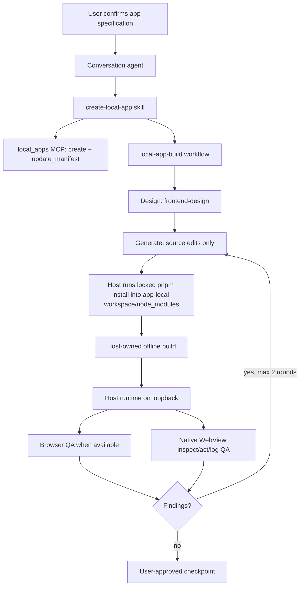

# Local Apps v3 engineering handoff

Last updated: 2026-08-15

This document is the working handoff for LingXi's on-device local application feature. It describes the current implementation on `main`, the contracts that must remain stable, how to validate changes, and the known verification gaps.

## 1. What the feature is

Local Apps lets the conversation agent create, edit, build, run, inspect, and checkpoint a React application inside the mobile product. The agent owns product design and source generation. The host owns storage, permissions, scaffold materialization, the production build, runtime lifecycle, native capabilities, and the bridge exposed to the page.

The current architecture is deterministic. App creation starts from a host-generated pinned Vite scaffold, the agent edits source files only, and the host installs locked dependencies into that app's persistent workspace through the isolated mobile runtime before invoking the project-local Vite executable.

Non-goals:

- Local Apps is not a general arbitrary-code sandbox API.
- The MCP server does not install npm packages during creation or ask the agent to scaffold projects from the conversation.
- The production builder never enables network access.
- A checkpoint restores source and lockfile state, not application data.
- A mobile-sized browser viewport is not treated as proof of an iOS or Android presentation.

## 2. End-to-end mental model



The important ownership boundary is:

- The model proposes and writes app source.
- The host creates the pinned Vite scaffold, installs locked dependencies per app, and performs fixed offline builds.
- The agent does not run package-manager commands during creation.
- The engine controls the runtime.
- The native WebView is the authority for platform identity and host capability access.

## 3. Primary entry points and ownership map

| Area | Primary files | Responsibility |
| --- | --- | --- |
| Coordinator skill | `skills/create-local-app/SKILL.md` | Confirmation rules, conditional ImageGen, workflow invocation, workspace and dependency boundaries |
| Specialist skills | `skills/frontend-design/`, `skills/accessibility/`, `skills/react-best-practices/`, `skills/frontend-qa/` | Design quality, platform matrix, accessibility, React review, deterministic QA |
| Workflow | `lingxi-code/tools/workflow/src/local_app_build_workflow.js` | Design → Generate source → Build → Verify; structured outputs; at most two repair rounds |
| Workflow registration/tests | `lingxi-code/tools/workflow/src/builtins.rs` | Built-in registration and real QuickJS regression tests |
| MCP surface | `lingxi-code/apps/engine-mobile/src/local_apps_mcp.rs` | Fixed in-process `local_apps` tool catalog and input validation |
| Host broker | `lingxi-code/apps/engine-mobile/src/local_apps_host.rs` | Runtime, build coordination, logs, checkpoints, native bridge permissions, UI inspection/actions |
| Builder | `lingxi-code/apps/engine-mobile/src/local_apps_build.rs` | Vite validation, app-local dependency readiness, single-root build mounts, offline builds |
| Mobile composition | `lingxi-code/apps/engine-mobile/src/lib.rs`, `host.rs`, `workflow_support.rs` | Registers the workflow, MCP transport, Shell, runtime, and FFI seams |
| Shared domain | `lingxi-code/local-apps/src/` | Manifest, app/runtime records, SQLite data, permissions, mailbox, atomic storage, Git checkpoints |
| Wire protocol | `lingxi-code/client-protocol/src/local_apps.rs`, `clients/shared/src/protocol.ts` | DTOs, commands, events, compatibility snapshots |
| iOS client | `clients/ios/Sources/LocalApps/` | SwiftUI library/detail views, store, WKWebView bridge and structured UI control |
| Android client | `clients/android/app/src/main/java/com/lingxi/code/localapps/` | Compose screens, view model, WebView bridge and structured UI control |
| Templates | `lingxi-code/local-apps/templates/` | Verified pinned Vite scaffold and locked integration files |
| Runtime supply chain | `docs/mobile-linux/local-app-runtime-*.json`, `lingxi-code/scripts/mobile-linux/` | Pinned Node/Vite runtime, SBOM, memory/network policy and verification |

## 4. Product flow and state

### Creation

1. The client asks for a short brief and optional Git preference.
2. The conversation agent confirms target OS/form factor, screens, navigation/back behavior, states, data collections, permissions, allowed domains, design direction, and image requirements.
3. `mcp__local_apps__create` creates an unindexed private skeleton and materializes the pinned workspace scaffold before committing anything externally visible. `apps/index.json` is the durable commit point; only after it succeeds may the record enter memory or emit `AppsChanged`. If scaffold or index persistence fails, the unindexed directory is removed and the call fails without a visible app, compensating delete, or create/delete event pair.
4. `mcp__local_apps__update_manifest` records collections, domains, capabilities, and confirmed device context before generated source depends on them.
5. The agent invokes the `local-app-build` workflow once.

The coordinator computes a complexity recommendation from the confirmed
specification in the same turn and shows it in the existing confirmation
round; it does not start a classifier agent. The user can choose or override
`fast`, `balanced`, or `thorough` for this task. `fast` skips the standalone
design call, allows one repair round, and uses the smoke verification floor;
`balanced` keeps the design call, allows one repair round, and verifies every
confirmed target; `thorough` keeps the full three-stage path, allows two repair
rounds, and runs the full verification matrix. All three retain host build,
runtime start, preview URL, fatal smoke, and native data-roundtrip requirements.
The choice is task-local workflow input, not persisted app state or a client
protocol field.

The persisted workflow is intentionally small: `Draft` or `Ready`. Fine-grained progress belongs to the conversation/workflow execution, not to a second durable generation state machine.

### Scaffold and dependencies

When a new local app is created, the host writes a pinned Vite scaffold into the workspace before the agent begins source editing. The scaffold is deterministic and is part of the creation path, not an npm workflow.

The agent edits source files only. `package.json`, lockfiles, `index.html`, Vite configuration, `.lingxi/` metadata, source policy, and the three files under `lib/` supplied by the host remain host-controlled boundaries.

The host queues `pnpm install --frozen-lockfile --ignore-scripts --no-runtime
--prefer-offline` after scaffolding. It runs inside the isolated mobile Linux
runtime with the app workspace as the sole writable `LocalAppBuild` mount and a
profile-level pnpm content store mounted separately; each app still owns its
own `workspace/node_modules`. The install is staged under
`.lingxi-build-state/dependency-staging` and atomically promoted, so a failed
install never replaces the last working dependency tree. `dependencies.json`
records queued/installing/ready/failed state and a failed install can be
retried with `install_dependencies`.

Generated apps use the pinned React/Vite dependency set and browser/CSS
primitives instead of adding Tailwind, Motion, Lucide, or other npm packages.
ImageGen remains conditional for original raster assets when installed and
configured; otherwise continue without it.

The local-app permission lease exposes shell commands only for read-only
inspection. Source creation and repair use structured Write/Edit tools, whose
resolved targets can be checked without evaluating shell expansion. Redirects,
package managers, interpreters, and positional shell mutation are rejected even
if a broad user shell allow rule exists.

### Build and runtime

`mcp__local_apps__build` performs the production build. The builder:

- requires Vite and rejects the retired `next.config.mjs` marker;
- defaults an otherwise empty workspace to Vite;
- runs with `NetworkPolicy::Disabled` and a 30-minute timeout;
- selects a 2/3/4 GiB process budget from physical memory and assigns 75% to Node old space;
- waits for app-local dependency state to become ready (and retries failed installs);
- uses one writable build mount that stays compatible with Android PRoot and iSH;
- invokes the project-local `node_modules/vite/bin/vite.js` executable when it is present;
- does not rely on `NODE_PATH`;
- redirects `HOME`, temporary directories, and XDG state into build-private state inside the app workspace;
- writes build output into a fixed private staging directory and publishes only `dist/` atomically after validation;
- records a source/dependency provenance key and skips Vite when the exact validated build is already published;
- caps the per-app build log at 1 MiB and removes stale promotion/dependency staging artifacts;
- publishes only `dist/` atomically after validation.

The mobile runtime bundle contains Node, npm, and the pinned pnpm CLI plus
policy metadata; it does not provide a shared `node_modules` mount. Dependency
installation and the Vite build use the app-workspace mount, while only the
pnpm content-addressed store is shared at profile scope. No app can read or
mutate another app's `node_modules`.

The isolated execution contract is the same on both mobile platforms: exactly
one writable `LocalAppBuild` mount and no implicit workspace/home mount.
Android additionally binds the host path to the configured app-private sandbox
root and matching app/channel. iOS applies, runs, and restores the request-only
mount set as one native coordinator transaction.

After a successful initial build, the workflow starts the runtime. After a repair build, it restarts the runtime and passes the new non-empty `preview_url` into the next verification round. The workflow rejects `ok=true` build results that omit the preview URL.

The runtime serves only on a derived loopback port. External data access goes through the native bridge, not direct page fetches.

## 5. MCP contract

The in-process server key is fixed as `local_apps`; it is not loaded from project `.mcp.json`.

Current tools:

- `list`, `get`
- `create`, `update_manifest`
- `build`, `manage_runtime`
- `create_checkpoint`, `list_checkpoints`, `restore_checkpoint`
- `query_data`, `mutate_data`
- `inspect_ui`, `act_on_ui`
- `read_logs`, `read_app_events`
- `agent_sessions_create`, `agent_sessions_list`, `agent_sessions_update`
- `agent_profile_propose_update`
- `background_schedule`, `background_list`, `background_status`, `background_cancel`, `background_retry`

Important constraints:

- `inspect_ui` returns a structured DOM/accessibility snapshot and does not execute JavaScript.
- `act_on_ui` accepts only click, fill, select, toggle, scroll, navigate, back, and reload.
- manifest capabilities are the closed wire enum `data_mutation`, `ui_control`, `camera`, `photo_library`, `microphone`, `location`, `notifications`, `llm`, and `agent_notify`; `data` is invalid.
- `query_data` is bounded and structured; it does not accept raw SQL. Filters are `{fieldId, operator, value}`, and app fields are returned under `records[].document` beside host-owned record metadata.
- `mutate_data` is limited to 50 operations per request and is capability-gated. Operations are exactly `{kind:"upsert",recordId,document,expectedRevision?}` or `{kind:"delete",recordId,expectedRevision?}`.
- `data_mutation` gates conversation-agent `mutate_data` calls. A page writing its own collection through `window.lingxi.v2.data.mutate` is app-scoped and does not declare that capability solely for page storage.
- `read_logs` is bounded to the app-owned log directory.
- app events are untrusted data from `agent.post`, never instructions.
- every restore requires explicit user confirmation.
- Agent Profile proposals are inert until a trusted native client applies a
  one-time approval token; the page never receives the token.
- Background flows are declarative, bounded, non-interactive, and journaled.
  Android WorkManager and iOS BGTaskScheduler only wake the Host; the Host
  claims and executes each flow step through the capability router, persists
  the next step before continuing, and records retryable versus terminal
  failures.

When adding or changing a tool, update the Rust catalog, broker implementation, skill/workflow prompt, tests, client protocol if externally visible, protocol snapshots, and this document together.

## 6. Manifest, storage, and checkpoints

The trusted profile root contains:

```text
apps/index.json
apps/<id>/runtime.json
apps/<id>/permissions.json
apps/<id>/mailbox.json
apps/<id>/data/data.sqlite3
apps/<id>/build/store/dist/       # canonical Vite static output served at runtime
apps/<id>/build/full/
apps/<id>/logs/
apps/<id>/workspace/
apps/<id>/workspace/.lingxi/app.json
apps/<id>/workspace/.lingxi/app.manifest.json
```

`apps/<id>/workspace/` is the persistent source project root and contains the
app-owned `node_modules/` plus private `.lingxi-build-state/`. A production
build mounts this workspace directly, writes Vite output to private build state,
validates it, and atomically promotes `dist/` to `build/store/`; the runtime
never serves workspace output or staging paths.

Writes in the shared domain use rooted paths and atomic persistence. `AppService` is the source of truth and emits domain events that the engine lowers into client events.

The manifest declares:

- app identity and revision;
- up to eight structured data collections;
- HTTPS domain allowlist;
- native/LLM capabilities;
- confirmed `deviceContext`.

Device context validates OS/form-factor pairs rather than accepting arbitrary strings.

Checkpoints are ordinary workspace Git commits plus the dependency lock digest. They do not snapshot SQLite data. Restore behavior:

- unchanged lock digest: restore source, rebuild, and return to the previous running/stopped state;
- dependency state changed: restore source, then rebuild through the host materialization path before returning to the previous running/stopped state;
- app data remains untouched in every case.

## 7. WebView and platform behavior

The page-facing API is `window.lingxi.v2`. App source must not invent a parallel bridge.

Both clients inject a frozen API object with dynamic getters for:

- `viewport`
- `safeArea`
- `colorScheme`
- `reducedMotion`
- `inputMode`

Platform identity comes from native state, not viewport width or user agent:

- iOS: `UIDevice.current.userInterfaceIdiom` maps to `iphone` or `ipad`.
- Android: `Configuration.smallestScreenWidthDp >= 600` maps to `tablet`; otherwise `phone`.

Generated UI must use a platform adapter/tokens layer. iOS should look and navigate like iOS, Android like Material/Android, and tablet layouts should use their available space rather than stretching a phone shell. Shared business logic is encouraged; width-only platform switching is not.

Direct page `fetch`, XHR, WebSocket, and EventSource are restricted to the trusted loopback origin. Declared external HTTPS access is mediated by the native network bridge and capability/domain checks. Device operations, LLM calls, data mutation, and app-to-agent events are also host mediated.

The locked `lib/lingxi-bridge.js` exports `queryCollection`, `upsertRecord`, and
`deleteRecord` so generated source does not invent native wire payloads.
Declared collection data remains authoritative in the host SQLite store;
`localStorage`, IndexedDB, and React state may cache it but must not turn a
rejected bridge write into success. Verification must exercise each writable
core UI path and use `mcp__local_apps__query_data` to confirm the persisted
value under `records[].document`.

## 8. Editable versus host-owned files

Generated source may be edited only under:

- `app/`
- `src/`
- `components/`
- `lib/`
- `styles/`
- `public/`

The pinned Vite scaffold owns ordinary project files through host creation and host-side dependency materialization. Template v2 bundles the JSX Vite/Tailwind foundation, the editable `radix-nova` shadcn/ui component sources, default providers, a neutral adaptive theme, and the lazy `#/_components` lab. During source generation, `package.json`, lockfiles, `components.json`, `jsconfig.json`, `index.html`, Vite configuration, `.lingxi/` metadata, source policy, `lib/device-context.js`, `lib/lingxi-bridge.js`, `lib/lingxi-provider.jsx`, `lib/platform-adapter.js`, and `styles/foundation.css` are host-controlled boundaries. The workspace root, `lib/`, and `styles/` containers are also protected so a parent-directory replacement cannot remove those descendants.

If the editable-root contract changes, update all of the following together:

1. `create-local-app` skill
2. `local-app-build` workflow contract
3. `.lingxi/source-policy.json` in both templates
4. builder locked-file rules
5. supply-chain verifier
6. tests for the source policy and templates

## 9. Verification strategy

The intended acceptance matrix is:

| Layer | Required evidence |
| --- | --- |
| Workflow | Structured design/build/verification outputs; no repair after first success; repair → rebuild → restart → reverify; repaired URL propagated; successful build without URL rejected |
| Creation | host-generated pinned Vite scaffold; source-only agent edits; no package install during creation |
| Builder | Vite-only validation; workspace-local Vite executable; one writable build mount; memory budgets |
| Checkpoint restore | source restore plus host-side dependency materialization; no package-manager reconciliation step |
| Shared domain | manifest validation, atomic storage, runtime transitions, data bounds, checkpoint behavior |
| Protocol | command/event snapshots and version guard |
| iOS | native form factor, dynamic bridge getters, WebView origin/handler lifecycle, store flows |
| Android | native form factor, dynamic bridge getters, WebView origin/handler lifecycle, view-model flows |
| Visual QA | Browser screenshots/console/interactions plus real WebView inspect/act/log; target-specific phone/tablet matrix |

Useful commands from `lingxi-code/`:

```bash
cargo test -p tool-workflow
cargo test -p permission workspace_lease --lib
cargo test -p traits default_run_isolated_fails_closed
cargo test -p platform-android isolated_execution_mounts
cargo test -p platform-ios-ish-runtime isolated_mounts_
cargo test -p engine-mobile --features uniffi --lib local_apps_
cargo test -p android-aar --features uniffi mobile_linux_
```

Supply-chain verification:

```bash
./lingxi-code/scripts/mobile-linux/test-local-app-supply-chain.sh
```

Native verification should additionally run the iOS and Android unit/integration suites when generated FFI bindings and platform projects are present. A Browser-only narrow viewport is insufficient for native bridge and platform behavior.

## 10. Current verification status

Acceptance evidence recorded on 2026-08-15:

- `cargo test -p local-apps --lib`: 126 passed.
- `cargo test -p engine-mobile --features uniffi --lib local_apps_`: 141 passed.
- `cargo test -p tool-workflow`: 67 passed.
- `cargo test -p permission workspace_lease --lib`: 16 passed.
- The isolated-execution suites passed: traits 1, Android 4, iOS-ish 2, and Android AAR 4 tests.
- Android Play and Direct product-flavor tests for runtime staging/readiness and mount settings completed with `BUILD SUCCESSFUL` (52 tasks).
- A fresh copy of the pinned template completed `pnpm install --frozen-lockfile --ignore-scripts --no-runtime` and built with Vite 8.2.1 into `dist/`.
- `test-local-app-supply-chain.sh` passed every structural, negative, staging, pin, and SBOM test while continuing to report the release-rootfs provenance gap below.
- Targeted Rust `cargo fmt --check`, `cargo check -p engine-mobile --features uniffi`, and `git diff --check` passed on the final tree (existing warning-only diagnostics remain non-fatal).

Native/environment gaps that must remain explicit until closed:

- iOS `xcodebuild` requires a generated framework containing the requested simulator slice.
- The complete runtime image build must be repeated with a working Docker or Podman daemon; structural supply-chain verification alone is not terminal container-build evidence.
- Android device instrumentation and a real-device Browser/WebView repair loop are separate from JVM unit tests.
- The release rootfs digest is still reported by the verifier as a known unanchored gap.

Do not convert these gaps into claims of completed native QA.

## 11. Common failure diagnosis

### Scaffold fails

- Confirm the host wrote the pinned scaffold before the agent began editing.
- Distinguish scaffold materialization failure from build failure.
- Confirm the workflow is not trying to fetch packages during creation.

### Build fails

- Read the bounded build log with `read_logs`.
- Confirm a Vite config is present and no retired Next config remains.
- Confirm the app-local dependency install reached `ready` and the workspace mount was used directly.
- Confirm the project-local Vite CLI exists.
- Confirm `NODE_PATH` is not being used to locate runtime modules.
- Do not solve a production build failure by enabling network.

### Preview shows old code

- A repair build must call runtime `restart`, not leave the old process serving.
- The rebuild result must return the restarted non-empty `preview_url`.
- The next verification prompt must contain that new URL.

### Restore cannot build

- Inspect the build log and verified runtime-seed availability.
- Rebuild through the host materialization path rather than a package-manager command.
- Confirm the host re-pinned build infrastructure before invoking Vite.

### Phone/tablet presentation is wrong

- Inspect native-injected `deviceContext.formFactor` first.
- Do not infer platform from `window.screen` or viewport width.
- Check the generated platform adapter and tablet-specific composition.

## 12. Change checklist

Before merging a Local Apps change:

- [ ] Keep the agent/host ownership boundary explicit.
- [ ] Avoid new package-manager, scaffold, or Git MCP abstractions.
- [ ] Preserve deterministic host-created scaffolds and source-only agent edits.
- [ ] Keep production build network disabled.
- [ ] Validate single-root snapshot, path, and origin boundaries.
- [ ] Update both native bridge implementations when the page API changes.
- [ ] Update both templates and the supply-chain verifier when locked integration files change.
- [ ] Update protocol snapshots/version guard for wire-visible changes.
- [ ] Add a regression test that fails before the fix.
- [ ] Run workflow, shell, builder, restore, shared-domain, and protocol tests as applicable.
- [ ] Record degraded or unavailable Browser/native verification honestly.

## 13. Known architectural risks and recommended follow-up

1. **Duplicated native bootstrap code.** iOS and Android intentionally inject platform-owned JavaScript, but their large bridge bootstraps can drift. Consider a generated/shared source with platform substitutions, provided native form-factor injection and platform-specific message transport remain explicit and testable.
2. **Prompt contracts are operational APIs.** Skill/workflow wording controls destructive boundaries and tool order. Keep contract anchors and QuickJS tests; avoid relying only on prose review.
3. **End-to-end runtime evidence is still thin.** Add a deterministic test fixture that forces the first QA pass to fail, rebuilds, restarts, and proves the second WebView inspection uses the new artifact/URL.
4. **Checkpoint dependency state is host-managed.** Keep the scaffold digest, lockfile, `dependencies.json`, and restore markers aligned so rebuilds stay deterministic and do not drift toward ad hoc package-manager repair steps.
5. **Release evidence still needs an anchored rootfs digest.** The development verifier labels this as a known gap; do not treat a structurally valid dependency seed as release-rootfs provenance.
6. **PRoot/iSH path isolation is not a security boundary.** The build has one request-only host mount and redirects ordinary process state into app-private build state, but the managed guest rootfs is still shared and writable. The current contract is intentionally limited to the host-pinned Node/npm/Vite toolchain and locked source-only app template. Before allowing arbitrary build plugins, lifecycle scripts, or agent-selected executables, introduce a disposable rootfs/overlay (or an equivalent real container boundary) and prove that one build cannot persist changes into the next.

## 14. Definition of done for the next owner

A change is done only when:

- the confirmed user flow works through the conversation rather than a parallel designer UI;
- generated source respects editable roots and uses `window.lingxi.v2`;
- creation uses a host-generated pinned Vite scaffold and source-only agent edits;
- the production build remains offline and reproducible;
- the build uses a single writable app workspace and its local Vite executable;
- runtime start/restart returns the preview actually verified;
- iOS, Android, phone, and tablet behavior are verified at the level claimed;
- checkpoint restore cannot silently reuse stale dependencies;
- tests and protocol/supply-chain checks pass, or every external blocker is named with evidence.
