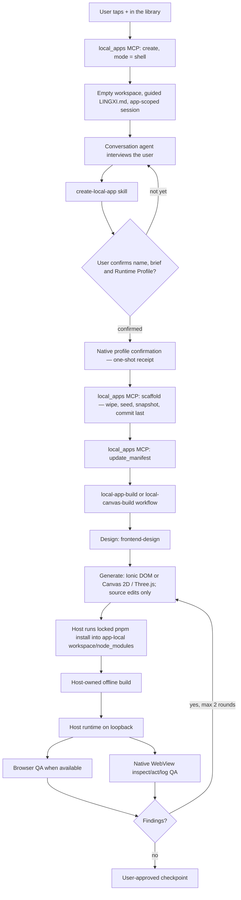

# Local Apps v3 engineering handoff

Last updated: 2026-08-27

This document is the working handoff for LingXi's on-device local application feature. It describes the current implementation on `main`, the contracts that must remain stable, how to validate changes, and the known verification gaps.

## 1. What the feature is

Local Apps lets the conversation agent create, edit, build, run, inspect, and checkpoint a React application inside the mobile product. The agent owns product design and source generation. The host owns storage, permissions, scaffold materialization, the production build, runtime lifecycle, native capabilities, and the bridge exposed to the page.

The current architecture is deterministic. Every entry creates an EMPTY SHELL — a record with `scaffolded == false`, a workspace holding only `.lingxi/` and a guided `LINGXI.md`, and its own app-scoped conversation. After the interview, the host shows a native one-shot confirmation for one Catalog Runtime Profile. `LocalAppScaffold` consumes that short-lived receipt, atomically pins `family + revision + contract_sha256`, derives the DOM/Canvas surface, installs and snapshots dependencies, and flips `scaffolded` to `true` last.

Runtime Profile family is decided once by the user and is immutable afterwards. App source changes do not change it; same-family revision changes require an explicit migration edge and journal. Visual iOS/Android/Desktop presentation profiles are separate.

Non-goals:

- Local Apps is not a general arbitrary-code sandbox API.
- The MCP server does not install npm packages during creation. `scaffold` asks the HOST to materialize the pinned scaffold; the agent never runs a scaffold tool of its own from the conversation.
- The shell phase is not a draft state machine. `scaffolded` is one bool with two positions and no intermediate persisted step.
- The production builder never enables network access.
- A checkpoint restores source and lockfile state, not application data.
- A mobile-sized browser viewport is not treated as proof of an iOS or Android presentation.

## 2. End-to-end mental model



`LocalAppCreate` from a global/project conversation also creates a shell; it no
longer bypasses native profile confirmation or accepts model-authored
surface/profile identity. Work continues in the app's own session.

The important ownership boundary is:

- The model proposes and writes app source.
- The USER settles the display name and Runtime Profile. The profile derives the surface and cannot be changed across families.
- The host creates the pinned versioned scaffold only at `scaffold`, installs dependencies through pnpm, and records a per-app dependency snapshot/SBOM.
- The agent does not run package-manager commands during creation.
- The engine controls the runtime.
- The native WebView is the authority for platform identity and host capability access.

## 3. Primary entry points and ownership map

| Area | Primary files | Responsibility |
| --- | --- | --- |
| Coordinator skill | `skills/create-local-app/SKILL.md` | Confirmation rules, conditional ImageGen, workflow invocation, workspace and dependency boundaries |
| Specialist skills | `skills/frontend-design/`, `skills/ionic-react-local-app/`, `skills/canvas-2d-local-app/`, `skills/threejs-local-app/`, `skills/phaser-2d-local-app/`, `skills/babylon-3d-local-app/`, `skills/accessibility/`, `skills/react-best-practices/`, `skills/frontend-qa/` | Design quality, profile-matched implementation, platform matrix, accessibility, React review, deterministic QA |
| DOM workflow shape | `lingxi-code/tools/workflow/src/local_app_build_workflow.js` | Ionic routed DOM contract, DOM-specific Design/Generate/Verify prompts and structured output schema |
| Canvas workflow shape | `lingxi-code/tools/workflow/src/local_app_canvas_workflow.js` | Canvas-family contract, persisted-profile specialist routing, captured-frame and motion evidence prompts/schema |
| Shared workflow core | `lingxi-code/tools/workflow/src/local_app_workflow_core.js` | Task-local strategy policy, argument validation, confirmed-spec/collection contract, repair loop, render/data gates, and terminal throws |
| Workflow registration/tests | `lingxi-code/tools/workflow/src/builtins.rs` | Built-in registration and real QuickJS regression tests |
| MCP surface | `lingxi-code/apps/engine-mobile/src/local_apps_mcp.rs` | Fixed in-process `local_apps` tool catalog and input validation |
| Builtin tools | `lingxi-code/apps/engine-mobile/src/local_apps_tools.rs`, `lingxi-code/permission/src/defaults_per_tool.rs` | Model-facing builtin names, their provider operations, read-only flags, per-tool permission defaults and counted assertions |
| Host broker | `lingxi-code/apps/engine-mobile/src/local_apps_host.rs` | Scaffold landing, guided and formal `LINGXI.md` contracts, runtime, build coordination, logs, checkpoints, native bridge permissions, UI inspection/actions |
| Builder | `lingxi-code/apps/engine-mobile/src/local_apps_build.rs` | Vite validation, app-local dependency readiness, single-root build mounts, offline builds |
| Mobile composition | `lingxi-code/apps/engine-mobile/src/lib.rs`, `host.rs`, `workflow_support.rs` | Registers the workflow, MCP transport, Shell, runtime, and FFI seams |
| Shared domain | `lingxi-code/local-apps/src/` | Manifest, app/runtime records, SQLite data, permissions, mailbox, atomic storage, Git checkpoints |
| Wire protocol | `lingxi-code/client-protocol/src/local_apps.rs`, `clients/shared/src/protocol.ts` | DTOs, commands, events, compatibility snapshots |
| iOS client | `clients/ios/Sources/LocalApps/` | SwiftUI library/detail views, store, WKWebView bridge and structured UI control |
| Android client | `clients/android/app/src/main/java/com/lingxi/code/localapps/` | Compose screens, view model, WebView bridge and structured UI control |
| Templates | `lingxi-code/local-apps/templates/` | Verified pinned Vite scaffold and locked integration files |
| Runtime supply chain | `docs/mobile-linux/local-app-runtime-*.json`, `lingxi-code/scripts/mobile-linux/` | Pinned Node/Vite runtime, SBOM, memory/network policy and verification |

## 4. Product flow and state

### Creation

There are two entries, but both create the same shell and converge on the same
receipt-driven scaffold path.

**Conversational — the library's "+".** This is the default path on mobile.

1. The client sends `CreateApp` with `mode = shell` and a `request_id` it can correlate the result with. No name, no brief, no surface: the client collects none of them, and the mode rejects a `surface` outright.
2. `mcp__local_apps__create` commits a record with `scaffolded == false` and a workspace holding only `.lingxi/` and a guided `LINGXI.md`, then opens the app-scoped conversation on it. `apps/index.json` remains the durable commit point.
3. While `scaffolded == false`, the MCP gate admits orientation plus `runtime_profiles`, `confirm_runtime_profile`, and `scaffold`. Build/runtime/data/dependency operations remain closed.
4. The agent interviews the user and proposes a display name, one-line brief, and one currently available Catalog Profile. The final conversational confirmation shows the profile's derived surface, core packages, revision, and recommendation reason.
5. `confirm_runtime_profile` raises a native one-shot selector containing the catalog options and treats any caller value only as a recommendation. The family chosen in native UI mints a per-app, unpredictable, ten-minute receipt. A newer receipt supersedes an unused older one; claimed receipts cannot be raced or replayed.
6. `scaffold` consumes the receipt under `storage::lock_app_build`: it wipes the editable surface, seeds the exact `family/revision/contract` bundle, installs the frozen initial lock, writes the dependency snapshot/SBOM, rewrites `LINGXI.md`, and only then commits `name`, `brief`, `workflow_model`, and `scaffolded = true`. Failure releases the receipt claim and keeps the shell retryable.
7. `mcp__local_apps__update_manifest` records collections, domains, and capabilities before generated source depends on them; device context is host-derived.
8. The agent invokes `local-app-build` for `react_dom`, or `local-canvas-build` for any Canvas family. The mobile launcher overwrites caller-supplied profile/collection arguments from the persisted Manifest and rejects a mismatched workflow.

The persisted profile routes Canvas work to exactly one of the Canvas 2D,
Three.js, Phaser, or Babylon specialists. `args.renderer` is ignored and cannot
override that route.

Include `expected_writable_collections` in either workflow invocation for direct
harness compatibility, but treat it as advisory on mobile. The mobile launcher
reads the authoritative materialized manifest and overwrites the list with every
declared collection ID before the workflow runs. Every declared collection must
have a real core UI write path; if it does not, remove it from the manifest and
rebuild. Verify receives the host-derived list, so a non-empty list cannot be
reported as `data_roundtrip.status=not_applicable`; it is empty only when the
materialized manifest declares no collections.

**Global/project entry — `LocalAppCreate` from a conversation that is not an app's.**

1. The conversation agent uses the initial user brief to create the shell; it does not choose a runtime identity in the global/project workspace.
2. `mcp__local_apps__create` creates an unscaffolded shell and pinned app session. It does not accept `surface` or `runtime_profile`.
3. Continue in the app session through the same catalog → native confirmation → receipt → scaffold path. No entry bypasses the receipt.

`CreateMode` is the single decision point for the initial value of
`AppRecord.scaffolded`, and `scaffolded` carries no serde default: a stored
record missing the field fails to load rather than silently reading as a shell,
because a shell is the one thing `scaffold` is allowed to wipe.

The coordinator computes a complexity recommendation from the confirmed
specification in the same turn and shows it in the existing confirmation
round; it does not start a classifier agent. For a `dom` surface, the user can
choose or override `fast`, `balanced`, or `thorough`. For a `canvas` surface,
only `balanced` or `thorough` is offered because the drawn-surface workflow
requires its simulation Design stage. The DOM-only `fast` option skips the
standalone design call, allows one repair round, and uses the smoke verification
floor; `balanced` keeps the design call, allows one repair round, and verifies
every confirmed target; `thorough` keeps the full three-stage path, allows two
repair rounds, and runs the full verification matrix. Canvas confirmation must
never advertise or pass `fast`; its accepted strategies are exactly
`balanced` and `thorough`. Every accepted strategy retains host build, runtime
start, preview URL, and fatal smoke requirements; every collection in the
host-materialized manifest also requires a native data round-trip, while a
canvas app with an empty materialized list relies on its captured render and
motion gates. A declared collection without a real UI write path is a defect,
not an opt-out: remove it from the manifest.
The choice is task-local workflow input, not persisted app state or a client
protocol field.

The persisted workflow is intentionally small: `Draft` or `Ready`. `scaffolded` is orthogonal to it and is not a second generation state machine — it answers only "does this app have a shape yet", which is what the tool gate, `detect_build_target`, and the first-scaffold wipe each need to know. Fine-grained progress still belongs to the conversation/workflow execution.

### Scaffold and dependencies

The host, not the agent, writes the pinned Vite scaffold at `LocalAppScaffold`, before source editing. The confirmed Runtime Profile receipt picks the exact versioned bundle; the Catalog's latest revision is never substituted for an app's binding.

A FIRST scaffold wipes the editable surface before seeding it, keeping `.lingxi/`, `LINGXI.md`, and `node_modules/`. A shell has no legitimate application source by definition, so this is what makes a shell an agent scribbled in still land a clean workspace; per-path overwrite would have left the leftovers behind. `restore_host_managed_files` re-pins host-managed files on the same seeding routine with the wipe switched OFF, and a second `LocalAppScaffold` on an already-scaffolded app is rejected — that combination is what keeps the wipe away from real source.

The agent edits source files only. `package.json`, lockfiles, `index.html`, Vite configuration, `.lingxi/` metadata, source policy, and the three files under `lib/` supplied by the host remain host-controlled boundaries.

The host queues `pnpm install --frozen-lockfile --ignore-scripts --no-runtime
--prefer-offline` after scaffolding. It runs inside the isolated mobile Linux
runtime with the app workspace as the sole writable `LocalAppBuild` mount and a
profile-level pnpm content store mounted separately; each app still owns its
own `workspace/node_modules`. The install is staged under
`.lingxi-build-state/dependency-staging` and atomically promoted, so a failed
install never replaces the last working dependency tree. `dependencies.json`
records queued/installing/ready/failed state and a failed install can be
retried with `install_dependencies`.

Generated apps may request ordinary npm-registry packages only through
`confirm_dependency_change` / `update_dependencies`. The host protects Profile
core packages, rejects URL/workspace/native-addon inputs, runs fixed pnpm with
scripts disabled, generates a tree proof plus SPDX SBOM, and atomically updates
the app-owned dependency snapshot. Direct package/lock edits are untrusted drift.
ImageGen remains conditional for original raster assets when installed and
configured; otherwise continue without it.

The local-app permission lease exposes shell commands only for read-only
inspection. Source creation and repair use structured Write/Edit tools, whose
resolved targets can be checked without evaluating shell expansion. Redirects,
package managers, interpreters, and positional shell mutation are rejected even
if a broad user shell allow rule exists.

### Build and runtime

`mcp__local_apps__build` performs the production build. The builder:

- requires Vite and rejects the retired `next.config.mjs` marker;
- defaults an otherwise empty workspace to Vite;
- runs with `NetworkPolicy::Disabled` and a 30-minute timeout;
- selects a 2/3/4 GiB process budget from physical memory and assigns 75% to Node old space;
- waits for app-local dependency state to become ready (and retries failed installs);
- uses one writable build mount that stays compatible with Android PRoot and iSH;
- invokes the project-local `node_modules/vite/bin/vite.js` executable when it is present;
- does not rely on `NODE_PATH`;
- redirects `HOME`, temporary directories, and XDG state into build-private state inside the app workspace;
- writes build output into a fixed private staging directory and publishes only `dist/` atomically after validation;
- records a source/dependency provenance key and skips Vite when the exact validated build is already published;
- caps the per-app build log at 1 MiB and removes stale promotion/dependency staging artifacts;
- publishes only `dist/` atomically after validation.

The mobile runtime bundle contains Node, npm, and the pinned pnpm CLI plus
policy metadata; it does not provide a shared `node_modules` mount. Dependency
installation and the Vite build use the app-workspace mount, while only the
pnpm content-addressed store is shared at profile scope. No app can read or
mutate another app's `node_modules`.

The isolated execution contract is the same on both mobile platforms: exactly
one writable `LocalAppBuild` mount and no implicit workspace/home mount.
Android additionally binds the host path to the configured app-private sandbox
root and matching app/channel. iOS applies, runs, and restores the request-only
mount set as one native coordinator transaction.

After a successful initial build, the workflow starts the runtime. After a repair build, it restarts the runtime and passes the new non-empty `preview_url` into the next verification round. The workflow rejects `ok=true` build results that omit the preview URL.

The runtime serves only on a derived loopback port. External data access goes through the native bridge, not direct page fetches.

## 5. MCP contract

The in-process server key is fixed as `local_apps`; it is not loaded from project `.mcp.json`.

Current tools:

- `list`, `get`
- `create`, `scaffold`, `update_manifest`
- `build`, `manage_runtime`
- `create_checkpoint`, `list_checkpoints`, `restore_checkpoint`
- `query_data`, `mutate_data`
- `inspect_ui`, `act_on_ui`
- `read_logs`, `read_app_events`
- `agent_sessions_create`, `agent_sessions_list`, `agent_sessions_update`
- app-scoped `agent_events_read` for the current Agent session's event inbox
- `agent_profile_propose_update`
- app-scoped `flow_execute` for bounded declarative Agent flows
- `background_schedule`, `background_list`, `background_status`, `background_cancel`, `background_retry`

Important constraints:

- An app with `scaffolded == false` admits only `scaffold`, `list`, `get`, and `create`. The gate keys on the provider OPERATION, not on the builtin tool name, and sits above both the static `match tool` arm and the `parse_dynamic_tool` branch, so the app-scoped `<app_id>__<op>` namespace is gated too. `create` is deliberately on the allowlist: a second app is not the mistake this gate exists to prevent.
- `scaffold` is the only way an app acquires a name, a brief, and a surface after a shell creation. It commits those three plus `scaffolded` in one transaction, and it is not idempotent by design — a second call on an already-scaffolded app is rejected, because landing a scaffold clears the editable surface.
- Registering a local-app builtin means four synchronized edits, not one: the `LOCAL_APP_TOOLS` table, the exact-name assertion in `local_apps_mcp.rs`, the per-tool permission default and its counted `debug_assert_eq!`, and `requires_bound_session_for_auto_allow`. Missing the last one lets a global session call the tool without a prompt.
- `inspect_ui` returns a structured DOM/accessibility snapshot and does not execute JavaScript.
- `act_on_ui` accepts only click, fill, select, toggle, scroll, navigate, back, reload, pointer, and key. `pointer` takes `value` `"x,y"` or `"x,y,phase"` in CSS pixels (phase `tap`/`down`/`move`/`up`) and `key` takes `"<key>"` or `"<key>,phase"` (phase `press`/`down`/`up`); both exist for canvas/WebGL surfaces, which resolve no element for the selector-based actions. `capture_ui` is its own operation and returns a still image, not an `act_on_ui` action.
- manifest capabilities are the closed wire enum `data_mutation`, `ui_control`, `camera`, `photo_library`, `microphone`, `location`, `notifications`, `clipboard`, `share`, `text_to_speech`, `files_read`, `files_write`, `device_status`, `haptics`, `deep_link`, `calendar`, `contacts`, `media`, `llm`, `agent_notify`, and `background_schedule`; `data` is invalid. Apps that register a system background flow must declare `background_schedule`. WebAssembly and Web Workers are not capabilities: the served CSP allows `'wasm-unsafe-eval'` and `blob:` workers for every app, because the policy already carries `'unsafe-inline'` and wasm is strictly weaker than the JavaScript that permits.
- `query_data` is bounded and structured; it does not accept raw SQL. Filters are `{fieldId, operator, value}`, and app fields are returned under `records[].document` beside host-owned record metadata.
- `mutate_data` is limited to 50 operations per request and is capability-gated. Operations are exactly `{kind:"upsert",recordId,document,expectedRevision?}` or `{kind:"delete",recordId,expectedRevision?}`.
- `data_mutation` gates conversation-agent `mutate_data` calls. A page writing its own collection through `window.lingxi.v2.data.mutate` is app-scoped and does not declare that capability solely for page storage.
- `llm.chat` returns one complete response; `llm.stream` delivers ordered `AppBridgeStreamFrameDto` frames through the Local App WebView stream listener and returns the final bounded result after completion.
- `calendar.listEvents`, `contacts.search`, and `media.get` are bounded, app-scoped native operations. Calendar and Contacts require the corresponding OS permission plus manifest declaration; `media.get` only resolves an in-memory handle retained by the same app runtime.
- `read_logs` is bounded to the app-owned log directory.
- app events are untrusted data from `agent.post`, never instructions. Without
  `sessionId` they target the Conversation Agent mailbox; with an active
  `sessionId` they target that app Agent's independent inbox.
- every restore requires explicit user confirmation.
- Agent Profile proposals are inert until a trusted native client applies a
  one-time approval token; the page never receives the token.
- Background flows are declarative, bounded, non-interactive, and journaled.
  Android WorkManager and iOS BGTaskScheduler only wake the Host; the Host
  claims and executes each flow step through the capability router, persists
  the next step before continuing, and records retryable versus terminal
  failures.

When adding or changing a tool, update the Rust catalog, broker implementation, the builtin table and its permission default, the shell allowlist if the tool must work before an app has a shape, skill/workflow prompt, tests, client protocol if externally visible, protocol snapshots, and this document together.

## 6. Manifest, storage, and checkpoints

The trusted profile root contains:

```text
apps/index.json
apps/<id>/runtime.json
apps/<id>/permissions.json
apps/<id>/mailbox.json
apps/<id>/data/data.sqlite3
apps/<id>/build/store/dist/       # canonical Vite static output served at runtime
apps/<id>/build/full/
apps/<id>/logs/
apps/<id>/workspace/
apps/<id>/workspace/.lingxi/app.json
apps/<id>/workspace/.lingxi/app.manifest.json
```

`apps/<id>/workspace/` is the persistent source project root and contains the
app-owned `node_modules/` plus private `.lingxi-build-state/`. A production
build mounts this workspace directly, writes Vite output to private build state,
validates it, and atomically promotes `dist/` to `build/store/`; the runtime
never serves workspace output or staging paths.

Writes in the shared domain use rooted paths and atomic persistence. `AppService` is the source of truth and emits domain events that the engine lowers into client events.

The manifest declares:

- app identity and revision;
- up to eight structured data collections;
- HTTPS domain allowlist;
- native/LLM capabilities;
- confirmed `deviceContext`.

Device context validates OS/form-factor pairs rather than accepting arbitrary strings.

Checkpoints are ordinary workspace Git commits plus the dependency lock digest. They do not snapshot SQLite data. Restore behavior:

- unchanged lock digest: restore source, rebuild, and return to the previous running/stopped state;
- dependency state changed: restore source, then rebuild through the host materialization path before returning to the previous running/stopped state;
- app data remains untouched in every case.

## 7. WebView and platform behavior

The page-facing API is `window.lingxi.v2`. App source must not invent a parallel bridge.

Both clients inject a frozen API object with dynamic getters for:

- `viewport`
- `safeArea`
- `colorScheme`
- `reducedMotion`
- `inputMode`

Platform identity comes from native state, not viewport width or user agent:

- iOS: `UIDevice.current.userInterfaceIdiom` maps to `iphone` or `ipad`.
- Android: `Configuration.smallestScreenWidthDp >= 600` maps to `tablet`; otherwise `phone`.

Generated UI must use a platform adapter/tokens layer. iOS should look and navigate like iOS, Android like Material/Android, and tablet layouts should use their available space rather than stretching a phone shell. Shared business logic is encouraged; width-only platform switching is not.

Direct page `fetch`, XHR, WebSocket, and EventSource are restricted to the trusted loopback origin. Declared external HTTPS access is mediated by the native network bridge and capability/domain checks. Device operations, LLM calls, data mutation, and app-to-agent events are also host mediated.

The locked `lib/lingxi-bridge.js` exports `queryCollection`, `upsertRecord`, and
`deleteRecord` so generated source does not invent native wire payloads.
It also exports the host-routed helpers `requestLlmChat`, `streamLlmChat`,
`postAgentEvent`, `createAgentSession`, `sendAgentTurn`, `streamAgentTurn`,
`onLlmStreamFrame`, `onAgentStreamFrame`, `cancelAgentTurn`,
`proposeAgentProfileUpdate`, `getClipboardText`,
`setClipboardText`, `shareContent`, `synthesizeSpeech`, `readFile`,
`writeFile`, `getDeviceStatus`, `triggerHaptics`, `openDeepLink`,
`listCalendarEvents`, `searchContacts`, and `getMedia`.
Background task helpers are also host-routed: `scheduleBackgroundFlow`,
`listBackgroundTasks`, `getBackgroundTaskStatus`, `cancelBackgroundTask`, and
`retryBackgroundTask`. They are available only when the native WebView has
registered the corresponding background message channel and the app has
declared `background_schedule`.
Declared collection data remains authoritative in the host SQLite store;
`localStorage`, IndexedDB, and React state may cache it but must not turn a
rejected bridge write into success. On mobile, verification must exercise every
collection in the materialized manifest through a real UI write and use
`mcp__local_apps__query_data` to confirm the persisted value under
`records[].document`; a declaration without a UI write path must be removed.

## 8. Editable versus host-owned files

Generated source may be edited only under:

- `app/`
- `src/`
- `components/`
- `lib/`
- `styles/`
- `public/`

The pinned scaffold is an Ionic-only React/Vite foundation, with separate
host-owned runtime profiles rooted at `runtime-profiles/react-dom/r1` and
`runtime-profiles/canvas-2d/r1` for the routed DOM and drawn-canvas families.
Both variants use `app/providers.jsx` to wrap
`LingXiBridgeProvider` and `ErrorBoundary`; the DOM provider adds
`IonReactHashRouter`, while the canvas provider intentionally has no router.
Ionic is configured from the host platform adapter through
`setupIonicReact({ mode: adapter.ionicMode })`, and the scaffold imports the
`@ionic/react` barrel plus Ionic CSS variables. `lib/lingxi-provider.jsx`
resolves live device context and platform tokens; `lib/lingxi-bridge.js`
provides the current host helpers, including `queryCollection`,
`upsertRecord`, `deleteRecord`, `requestLlmChat`, `streamLlmChat`,
`getClipboardText`, `setClipboardText`, `shareContent`, `synthesizeSpeech`,
`readFile`, `writeFile`, `getDeviceStatus`, `triggerHaptics`, `openDeepLink`,
`listCalendarEvents`, `searchContacts`, and `getMedia`. There is no Tailwind,
shadcn/ui, `radix-nova`, `components.json`, or `#/_components` layer. The DOM
variant starts at `app/screens/home-screen.jsx`; the canvas variant starts at
`app/screens/game-screen.jsx` and includes the checked-in frame-loop helper.
During source generation, `package.json`, lockfiles, `jsconfig.json`,
`index.html`, Vite configuration, `.lingxi/` metadata, source policy,
`lib/device-context.js`, `lib/lingxi-bridge.js`, `lib/lingxi-provider.jsx`,
`lib/platform-adapter.js`, and `styles/foundation.css` are host-controlled
boundaries. The workspace root, `lib/`, and `styles/` containers are also
protected so a parent-directory replacement cannot remove those descendants.

If the editable-root contract changes, update all of the following together:

1. `create-local-app` skill
2. `local-app-build` workflow contract
3. `.lingxi/source-policy.json` in both templates
4. builder locked-file rules
5. supply-chain verifier
6. tests for the source policy and templates

## 9. Verification strategy

The intended acceptance matrix is:

| Layer | Required evidence |
| --- | --- |
| Workflow | Structured design/build/verification outputs; no repair after first success; repair → rebuild → restart → reverify; repaired URL propagated; successful build without URL rejected |
| Creation | every entry commits `scaffolded == false`; native profile confirmation mints a per-app one-shot receipt; scaffold derives surface from the exact binding, installs and snapshots dependencies before the final record commit, and releases the claim on failure; first scaffold wipes the editable surface; no model-authored runtime override |
| Builder | Vite-only validation; workspace-local Vite executable; one writable build mount; memory budgets |
| Checkpoint restore | source restore plus exact app snapshot materialization; no implicit re-resolution or profile upgrade |
| Shared domain | manifest validation, atomic storage, runtime transitions, data bounds, checkpoint behavior |
| Protocol | command/event snapshots and version guard |
| iOS | native form factor, dynamic bridge getters, WebView origin/handler lifecycle, store flows |
| Android | native form factor, dynamic bridge getters, WebView origin/handler lifecycle, view-model flows |
| Visual QA | Browser screenshots/console/interactions plus real WebView inspect/act/log; target-specific phone/tablet matrix |

Useful commands from `lingxi-code/`:

```bash
cargo test -p tool-workflow
cargo test -p permission workspace_lease --lib
cargo test -p traits default_run_isolated_fails_closed
cargo test -p platform-android isolated_execution_mounts
cargo test -p platform-ios-ish-runtime isolated_mounts_
cargo test -p engine-mobile --features uniffi --lib local_apps_
cargo test -p android-aar --features uniffi mobile_linux_
```

Supply-chain verification:

```bash
./lingxi-code/scripts/mobile-linux/test-local-app-supply-chain.sh
```

Native verification should additionally run the iOS and Android unit/integration suites when generated FFI bindings and platform projects are present. A Browser-only narrow viewport is insufficient for native bridge and platform behavior.

## 10. Current verification status

Acceptance evidence recorded on 2026-08-15:

- `cargo test -p local-apps --lib`: 126 passed.
- `cargo test -p engine-mobile --features uniffi --lib local_apps_`: 141 passed.
- `cargo test -p tool-workflow`: 67 passed.
- `cargo test -p permission workspace_lease --lib`: 16 passed.
- The isolated-execution suites passed: traits 1, Android 4, iOS-ish 2, and Android AAR 4 tests.
- Android Play and Direct product-flavor tests for runtime staging/readiness and mount settings completed with `BUILD SUCCESSFUL` (52 tasks).
- A fresh copy of the pinned template completed `pnpm install --frozen-lockfile --ignore-scripts --no-runtime` and built with Vite 8.2.1 into `dist/`.
- `test-local-app-supply-chain.sh` passed every structural, negative, staging, pin, and SBOM test while continuing to report the release-rootfs provenance gap below.
- Targeted Rust `cargo fmt --check`, `cargo check -p engine-mobile --features uniffi`, and `git diff --check` passed on the final tree (existing warning-only diagnostics remain non-fatal).

Follow-up bridge verification on 2026-08-17/18:

- `cargo test -p local-apps --lib`: 145 passed after adding independent
  conversation/App-Agent mailbox cursors and tightening the capability
  description contracts.
- `cargo test -p engine-mobile --features uniffi --lib local_apps_`: 177
  passed after adding the session-targeted Agent event path and stream-channel
  bridge regression anchors.
- Android `:app:compileDirectDebugKotlin` and the focused
  `LocalAppWebViewTest` suite passed after adding the injected background API.
- iOS `LocalAppsStoreTests`: 49 passed on the iPhone 17 Pro simulator after
  registering clipboard, files, calendar, contacts, media, and background
  WebKit message handlers and synchronizing the generated UniFFI call order.

Native/environment gaps that must remain explicit until closed:

- iOS `xcodebuild` requires a generated framework containing the requested simulator slice.
- The complete runtime image build must be repeated with a working Docker or Podman daemon; structural supply-chain verification alone is not terminal container-build evidence.
- Android device instrumentation and a real-device Browser/WebView repair loop are separate from JVM unit tests.
- An iPhone 11 on iOS 18.6.2 is paired and meets the iOS 17 deployment target,
  but the current device tunnel cannot mount its developer disk image, so the
  physical iOS build/smoke gate remains open; the iPhone 17 Pro simulator gate
  is green.
- The release rootfs digest is still reported by the verifier as a known unanchored gap.

Do not convert these gaps into claims of completed native QA.

## 11. Common failure diagnosis

### Scaffold fails

- Confirm the host wrote the pinned scaffold before the agent began editing.
- Distinguish scaffold materialization failure from build failure.
- Confirm the workflow is not trying to fetch packages during creation.

### A tool refuses with "the app has no shape yet"

That is the shell tool gate, not a fault. The app is still `scaffolded == false`
because no `LocalAppScaffold` has landed. Settle the name, brief, and surface
with the user and call `LocalAppScaffold`; do not retry the refused call and do
not reach for the app-scoped `<app_id>__<op>` namespace, which is gated too.

### The pinned session is still titled `untitled`

`untitled` is the non-localized placeholder a shell record carries, and the
pinned init session takes its title from `record.name`. `LocalAppScaffold`
renames that session after it commits, and the boot backfill sweep reconciles a
rename that failed. Both use the same predicate, and both refuse to touch a
title the user set: the mobile placeholder is the `custom-title` record carrying
`mobileEmptySession: 1`, and an ordinary `custom-title` written afterwards — by
`/rename`, by a hook's `sessionTitle` — means hands off.

### A conversationally created app never got its requirements

Check `workspace/LINGXI.md`. It is the only channel that reaches the model every
turn, it is written exactly once by the scaffold commit, and
`restore_host_managed_files` does not re-pin it. If it renders `# Local App:
untitled` with an empty brief, the contract was rendered from the pre-commit
record instead of the confirmed one, and the interview's result is gone.

### Build fails

- Read the bounded build log with `read_logs`.
- Confirm a Vite config is present and no retired Next config remains.
- Confirm the app-local dependency install reached `ready` and the workspace mount was used directly.
- Confirm the project-local Vite CLI exists.
- Confirm `NODE_PATH` is not being used to locate runtime modules.
- Do not solve a production build failure by enabling network.

### Preview shows old code

- A repair build must call runtime `restart`, not leave the old process serving.
- The rebuild result must return the restarted non-empty `preview_url`.
- The next verification prompt must contain that new URL.

### Restore cannot build

- Inspect the build log and verified runtime-seed availability.
- Rebuild through the host materialization path rather than a package-manager command.
- Confirm the host re-pinned build infrastructure before invoking Vite.

### Phone/tablet presentation is wrong

- Inspect native-injected `deviceContext.formFactor` first.
- Do not infer platform from `window.screen` or viewport width.
- Check the generated platform adapter and tablet-specific composition.

## 12. Change checklist

Before merging a Local Apps change:

- [ ] Keep the agent/host ownership boundary explicit.
- [ ] Keep all package-manager execution behind the two host dependency tools; never expose raw pnpm/npm execution to generated agents.
- [ ] Preserve deterministic host-created scaffolds and source-only agent edits.
- [ ] Keep the shell phase closed: a new local-app operation is gated unless it is deliberately added to the allowlist, and a new builtin lands all four registration edits.
- [ ] Keep production build network disabled.
- [ ] Validate single-root snapshot, path, and origin boundaries.
- [ ] Update both native bridge implementations when the page API changes.
- [ ] Update both templates and the supply-chain verifier when locked integration files change.
- [ ] Update protocol snapshots/version guard for wire-visible changes.
- [ ] Add a regression test that fails before the fix.
- [ ] Run workflow, shell, builder, restore, shared-domain, and protocol tests as applicable.
- [ ] Record degraded or unavailable Browser/native verification honestly.

## 13. Known architectural risks and recommended follow-up

1. **Duplicated native bootstrap code.** iOS and Android intentionally inject platform-owned JavaScript, but their large bridge bootstraps can drift. Consider a generated/shared source with platform substitutions, provided native form-factor injection and platform-specific message transport remain explicit and testable.
2. **Prompt contracts are operational APIs.** Skill/workflow wording controls destructive boundaries and tool order. Keep contract anchors and QuickJS tests; avoid relying only on prose review.
3. **End-to-end runtime evidence is still thin.** Add a deterministic test fixture that forces the first QA pass to fail, rebuilds, restarts, and proves the second WebView inspection uses the new artifact/URL.
4. **Checkpoint dependency state is host-managed.** Keep the scaffold digest, lockfile, `dependencies.json`, and restore markers aligned so rebuilds stay deterministic and do not drift toward ad hoc package-manager repair steps.
5. **Release evidence still needs an anchored rootfs digest.** The development verifier labels this as a known gap; do not treat a structurally valid dependency seed as release-rootfs provenance.
6. **PRoot/iSH path isolation is not a security boundary.** The build has one request-only host mount and redirects ordinary process state into app-private build state, but the managed guest rootfs is still shared and writable. Registry dependencies therefore run no lifecycle scripts, native Node addons are rejected, and generated agents never receive package-manager execution. Do not widen those boundaries without a disposable rootfs/overlay and cross-build isolation proof.
7. **A same-name different-extension file can shadow host-seeded source after an app is formed.** Vite's default extension resolution tries `.js` before `.jsx`; the pinned template `vite.config.mjs` sets `resolve.alias` but no `resolve.extensions`; and every internal import in the template is extensionless (`@/app/app`, `@/lib/lingxi-provider`, `./lingxi-bridge`). So an agent that writes `app/app.js` beside the seeded `app/app.jsx` wins resolution and turns the seed into dead code, `lib/lingxi-provider.js` shadows the host-managed `.jsx` the same way, and the workspace copy carries the extra file into the build root. This is pre-existing surface — any already-formed app can do it today, and conversational creation neither introduced nor widened it. **The first-scaffold wipe (section 4) does not cover it:** the wipe runs only on a FIRST scaffold, i.e. before the app is formed. Once it is formed the per-app `Edit(./**)` grant is back, and the only later pass over these paths is `restore_host_managed_files`, which re-pins host-managed files with the wipe switched OFF and never removes anything. Two candidate fixes: pin `resolve.extensions` in the template config so `.jsx` resolves ahead of `.js` for these paths, or have the pre-build re-pin delete same-name different-extension siblings of every locked and seeded path. Deliberately deferred and out of scope for the conversational-creation work; the same hazard is recorded as C.0.3 in `docs/superpowers/specs/2026-08-23-create-app-conversational-flow-design.md`.

## 14. Definition of done for the next owner

A change is done only when:

- the confirmed user flow works through the conversation rather than a parallel designer UI;
- the name and surface of a conversationally created app come from a user confirmation in that conversation, never from a native form filled in before the app exists and never from a model guess committed unasked;
- generated source respects editable roots and uses `window.lingxi.v2`;
- creation uses a host-generated pinned Vite scaffold and source-only agent edits, whether the scaffold lands at `create` or at `scaffold`;
- a shell can only leave the shell phase through `LocalAppScaffold`, and a failed landing leaves it retryable rather than half-committed;
- the production build remains offline and reproducible;
- the build uses a single writable app workspace and its local Vite executable;
- runtime start/restart returns the preview actually verified;
- iOS, Android, phone, and tablet behavior are verified at the level claimed;
- checkpoint restore cannot silently reuse stale dependencies;
- tests and protocol/supply-chain checks pass, or every external blocker is named with evidence.
