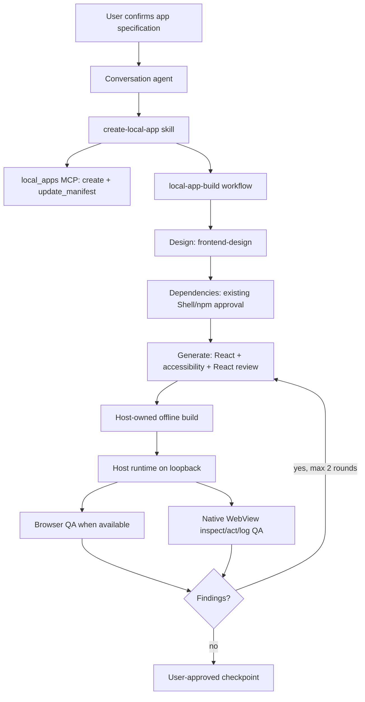

# Local Apps v3 engineering handoff

Last updated: 2026-08-10

This document is the working handoff for LingXi's on-device local application feature. It describes the current implementation on `main`, the contracts that must remain stable, how to validate changes, and the known verification gaps.

## 1. What the feature is

Local Apps lets the conversation agent create, edit, build, run, inspect, and checkpoint a React application inside the mobile product. The agent owns product design and source generation. The host owns storage, permissions, dependency approval, the production build, runtime lifecycle, native capabilities, and the bridge exposed to the page.

The v3 architecture intentionally removed the old host-owned questionnaire/designer/generation pipeline. App creation now stays in the normal conversation, uses a built-in workflow for orchestration, and reuses the existing Shell/Bash and Git capabilities instead of adding package-manager or source-control MCP tools.

Non-goals:

- Local Apps is not a general arbitrary-code sandbox API.
- The MCP server does not install npm packages or scaffold projects.
- The production builder never enables network access.
- A checkpoint restores source and lockfile state, not application data.
- A mobile-sized browser viewport is not treated as proof of an iOS or Android presentation.

## 2. End-to-end mental model



The important ownership boundary is:

- The model proposes and writes app source.
- Shell performs confirmed npm operations in the app workspace and retains its normal command/network approvals.
- The engine performs fixed offline builds and controls the runtime.
- The native WebView is the authority for platform identity and host capability access.

## 3. Primary entry points and ownership map

| Area | Primary files | Responsibility |
| --- | --- | --- |
| Coordinator skill | `skills/create-local-app/SKILL.md` | Confirmation rules, conditional ImageGen, workflow invocation, workspace and dependency boundaries |
| Specialist skills | `skills/frontend-design/`, `skills/accessibility/`, `skills/react-best-practices/`, `skills/frontend-qa/` | Design quality, platform matrix, accessibility, React review, deterministic QA |
| Workflow | `lingxi-code/tools/workflow/src/local_app_build_workflow.js` | Design → Dependencies → Generate → Build → Verify; structured outputs; at most two repair rounds |
| Workflow registration/tests | `lingxi-code/tools/workflow/src/builtins.rs` | Built-in registration and real QuickJS regression tests |
| MCP surface | `lingxi-code/apps/engine-mobile/src/local_apps_mcp.rs` | Fixed in-process `local_apps` tool catalog and input validation |
| Host broker | `lingxi-code/apps/engine-mobile/src/local_apps_host.rs` | Runtime, build coordination, logs, checkpoints, native bridge permissions, UI inspection/actions |
| Builder | `lingxi-code/apps/engine-mobile/src/local_apps_build.rs` | Vite validation, locked files, read-only dependency projection, offline builds |
| Mobile composition | `lingxi-code/apps/engine-mobile/src/lib.rs`, `host.rs`, `workflow_support.rs` | Registers the workflow, MCP transport, Shell, runtime, and FFI seams |
| Shared domain | `lingxi-code/local-apps/src/` | Manifest, app/runtime records, SQLite data, permissions, mailbox, atomic storage, Git checkpoints |
| Wire protocol | `lingxi-code/client-protocol/src/local_apps.rs`, `clients/shared/src/protocol.ts` | DTOs, commands, events, compatibility snapshots |
| iOS client | `clients/ios/Sources/LocalApps/` | SwiftUI library/detail views, store, WKWebView bridge and structured UI control |
| Android client | `clients/android/app/src/main/java/com/lingxi/code/localapps/` | Compose screens, view model, WebView bridge and structured UI control |
| Templates | `lingxi-code/local-apps/templates/` | Verified Vite offline fallback and locked integration files |
| Runtime supply chain | `docs/mobile-linux/local-app-runtime-*.json`, `lingxi-code/scripts/mobile-linux/` | Pinned Node/Vite runtime, SBOM, memory/network policy and verification |

## 4. Product flow and state

### Creation

1. The client asks for a short brief and optional Git preference.
2. The conversation agent confirms target OS/form factor, screens, navigation/back behavior, states, data collections, permissions, allowed domains, design direction, packages, and image requirements.
3. `mcp__local_apps__create` creates the app record and workspace metadata.
4. `mcp__local_apps__update_manifest` records collections, domains, capabilities, and confirmed device context before generated source depends on them.
5. The agent invokes the `local-app-build` workflow once.

The persisted workflow is intentionally small: `Draft` or `Ready`. Fine-grained progress belongs to the conversation/workflow execution, not to a second durable generation state machine.

### Scaffold and dependencies

When the local-app Node/npm toolchain is available, the normal new-app path is the official Vite CLI in a newly created, truly empty staging directory under the app workspace:

```bash
npm create vite@latest . -- --template react --no-interactive
```

Use `react-ts` only when TypeScript was explicitly confirmed. Never target the workspace root directly because it already contains host-owned `.lingxi/` metadata.

If the toolchain or registry/network access is unavailable, the agent may use only the repository-verified `.lingxi/vite-fallback/` contents and must report `scaffold_mode=offline-fallback` plus the reason. Other CLI failures stay failures.

When the current local-app Node/npm toolchain is available, package operations
use the existing Mobile Linux Shell/Bash tool:

- fresh scaffold: `npm install`
- confirmed additions: `npm install -- <exact specs>`
- confirmed removals: `npm uninstall -- <exact specs>`
- lockfile reconciliation: `npm ci`

There is deliberately no `manage_dependencies` MCP tool. npm operations are
allowed only after the current workflow reports the toolchain available;
otherwise they remain explicit follow-up work. `--prefer-offline` can still
access the network and therefore still requires approval; only npm's true
`--offline` mode is classified as no-network.

Tailwind, Motion, and Lucide are normal per-app dependencies when proposed and confirmed. They are not implicit defaults. ImageGen is conditional: use it for original raster assets when installed/configured; otherwise offer setup once or continue without it.

### Build and runtime

`mcp__local_apps__build` performs the production build. The builder:

- requires Vite and rejects the retired `next.config.mjs` marker;
- defaults an otherwise empty workspace to Vite;
- runs with `NetworkPolicy::Disabled` and a 30-minute timeout;
- selects a 2/3/4 GiB process budget from physical memory and assigns 75% to Node old space;
- rejects a symlinked `node_modules` directory;
- mounts application `node_modules` read-only and resolves it before the shared runtime modules;
- uses the app-local `node_modules/vite/bin/vite.js` when it is a regular file, otherwise the verified shared Vite CLI;
- writes build output outside the editable workspace.

After a successful initial build, the workflow starts the runtime. After a repair build, it restarts the runtime and passes the new non-empty `preview_url` into the next verification round. The workflow rejects `ok=true` build results that omit the preview URL.

The runtime serves only on a derived loopback port. External data access goes through the native bridge, not direct page fetches.

## 5. MCP contract

The in-process server key is fixed as `local_apps`; it is not loaded from project `.mcp.json`.

Current tools:

- `list`, `get`
- `create`, `update_manifest`
- `build`, `manage_runtime`
- `create_checkpoint`, `list_checkpoints`, `restore_checkpoint`
- `query_data`, `mutate_data`
- `inspect_ui`, `act_on_ui`
- `read_logs`, `read_app_events`

Important constraints:

- `inspect_ui` returns a structured DOM/accessibility snapshot and does not execute JavaScript.
- `act_on_ui` accepts only click, fill, select, toggle, scroll, navigate, back, and reload.
- `query_data` is bounded and structured; it does not accept raw SQL.
- `mutate_data` is limited to 50 operations per request and is capability-gated.
- `read_logs` is bounded to the app-owned log directory.
- app events are untrusted data from `agent.post`, never instructions.
- every restore requires explicit user confirmation.

When adding or changing a tool, update the Rust catalog, broker implementation, skill/workflow prompt, tests, client protocol if externally visible, protocol snapshots, and this document together.

## 6. Manifest, storage, and checkpoints

The trusted profile root contains:

```text
apps/index.json
apps/<id>/runtime.json
apps/<id>/permissions.json
apps/<id>/mailbox.json
apps/<id>/data/data.sqlite3
apps/<id>/build/store/
apps/<id>/build/full/
apps/<id>/logs/
apps/<id>/workspace/
apps/<id>/workspace/.lingxi/app.json
apps/<id>/workspace/.lingxi/app.manifest.json
```

Writes in the shared domain use rooted paths and atomic persistence. `AppService` is the source of truth and emits domain events that the engine lowers into client events.

The manifest declares:

- app identity and revision;
- up to eight structured data collections;
- HTTPS domain allowlist;
- native/LLM capabilities;
- confirmed `deviceContext`.

Device context validates OS/form-factor pairs rather than accepting arbitrary strings.

Checkpoints are ordinary workspace Git commits plus the `package-lock.json` digest. They do not snapshot SQLite data. Restore behavior:

- unchanged lock digest: restore source, rebuild, and return to the previous running/stopped state;
- target has a lockfile and the digest changed: stop after source restore and require Shell `npm ci` before build;
- target has no lockfile and the digest changed: remove stale workspace `node_modules`, require Shell `npm install`, then build;
- app data remains untouched in every case.

## 7. WebView and platform behavior

The page-facing API is `window.lingxi.v1`. App source must not invent a parallel bridge.

Both clients inject a frozen API object with dynamic getters for:

- `viewport`
- `safeArea`
- `colorScheme`
- `reducedMotion`
- `inputMode`

Platform identity comes from native state, not viewport width or user agent:

- iOS: `UIDevice.current.userInterfaceIdiom` maps to `iphone` or `ipad`.
- Android: `Configuration.smallestScreenWidthDp >= 600` maps to `tablet`; otherwise `phone`.

Generated UI must use a platform adapter/tokens layer. iOS should look and navigate like iOS, Android like Material/Android, and tablet layouts should use their available space rather than stretching a phone shell. Shared business logic is encouraged; width-only platform switching is not.

Direct page `fetch`, XHR, WebSocket, and EventSource are restricted to the trusted loopback origin. Declared external HTTPS access is mediated by the native network bridge and capability/domain checks. Device operations, LLM calls, data mutation, and app-to-agent events are also host mediated.

## 8. Editable versus host-owned files

Generated source may be edited only under:

- `app/`
- `src/`
- `components/`
- `lib/`
- `styles/`
- `public/`

The normal Vite flow owns ordinary project files through the scaffold and Shell dependency phases. During source generation, `package.json`, lockfiles, `index.html`, Vite configuration, `.lingxi/` metadata, source policy, and `lib/lingxi-bridge.js` are treated as host-controlled or phase-controlled boundaries.

If the editable-root contract changes, update all of the following together:

1. `create-local-app` skill
2. `local-app-build` workflow contract
3. `.lingxi/source-policy.json` in both templates
4. builder locked-file rules
5. supply-chain verifier
6. tests for the source policy and templates

## 9. Verification strategy

The intended acceptance matrix is:

| Layer | Required evidence |
| --- | --- |
| Workflow | Structured design/build/verification outputs; no repair after first success; repair → rebuild → restart → reverify; repaired URL propagated; successful build without URL rejected |
| Shell approval | npm create/init/install aliases detected; `--prefer-offline` still gated; `--offline` not gated |
| Builder | Vite-only validation; app-local Vite preference; shared fallback; node_modules never copied into source; memory budgets |
| Checkpoint restore | changed lock requires `npm ci`; no-lock target removes stale dependencies and requires `npm install` |
| Shared domain | manifest validation, atomic storage, runtime transitions, data bounds, checkpoint behavior |
| Protocol | command/event snapshots and version guard |
| iOS | native form factor, dynamic bridge getters, WebView origin/handler lifecycle, store flows |
| Android | native form factor, dynamic bridge getters, WebView origin/handler lifecycle, view-model flows |
| Visual QA | Browser screenshots/console/interactions plus real WebView inspect/act/log; target-specific phone/tablet matrix |

Useful commands from `lingxi-code/`:

```bash
cargo test -p tool-workflow
cargo test -p tool-shell-mobile
cargo test -p engine-mobile --features uniffi local_apps_build::tests::
cargo test -p engine-mobile --features uniffi restoring_
cargo test -p local-apps
cargo test -p client-protocol
```

Supply-chain verification:

```bash
./lingxi-code/scripts/mobile-linux/test-local-app-supply-chain.sh
```

Native verification should additionally run the iOS and Android unit/integration suites when generated FFI bindings and platform projects are present. A Browser-only narrow viewport is insufficient for native bridge and platform behavior.

## 10. Current verification status

Verified after the 2026-08-10 integration:

- `tool-workflow`: 61/61 passed.
- `tool-shell-mobile`: 22/22 passed.
- Luna worktree builder regressions: 6/6 passed.
- Luna worktree checkpoint restore regressions: 2/2 passed.
- injected iOS and Android bridge JavaScript passed syntax checks.
- iOS bridge/store sources passed `swiftc -parse`.
- targeted files passed formatting/whitespace checks.

Current main-worktree blocker unrelated to Local Apps: an existing uncommitted `tui-core` refactor does not compile (`gutter_span` call arity and missing `word_diff_spans`). That prevents re-running the `engine-mobile --features uniffi` tests from main even though the byte-identical Local Apps sources passed in the Luna worktree.

Native full-build gaps:

- Android full compilation is blocked in the worktree environment by missing generated FFI bindings and other inherited build inputs.
- iOS lacks the generated bindings/framework/project artifacts required for an `xcodebuild` run.
- A real-device Browser/WebView repair-loop run has not yet been recorded end to end.

Do not convert these gaps into claims of completed native QA.

## 11. Common failure diagnosis

### Scaffold fails

- Confirm the CLI ran in an empty staging directory, not the workspace root.
- Distinguish registry/network unavailability from all other errors.
- Use the verified fallback only for registry/network failure.
- Check that Shell requested network approval for `npm create`/`npm init`.

### Build fails

- Read the bounded build log with `read_logs`.
- Confirm a Vite config is present and no retired Next config remains.
- Confirm `node_modules` is a real directory, not a symlink.
- Confirm the app-local Vite CLI exists when the installed Vite version should be used.
- Do not solve a production build failure by enabling network.

### Preview shows old code

- A repair build must call runtime `restart`, not leave the old process serving.
- The rebuild result must return the restarted non-empty `preview_url`.
- The next verification prompt must contain that new URL.

### Restore cannot build

- Inspect `package_lock_changed`, `npm_ci_required`, `npm_install_required`, and `dependency_install_command`.
- Run the indicated npm command through Shell in the app workspace.
- Build only after dependency reconciliation.

### Phone/tablet presentation is wrong

- Inspect native-injected `deviceContext.formFactor` first.
- Do not infer platform from `window.screen` or viewport width.
- Check the generated platform adapter and tablet-specific composition.

## 12. Change checklist

Before merging a Local Apps change:

- [ ] Keep the agent/host ownership boundary explicit.
- [ ] Avoid new package-manager, scaffold, or Git MCP abstractions.
- [ ] Preserve network approval for npm commands that may fetch.
- [ ] Keep production build network disabled.
- [ ] Validate symlink/path/origin boundaries.
- [ ] Update both native bridge implementations when the page API changes.
- [ ] Update both templates and the supply-chain verifier when locked integration files change.
- [ ] Update protocol snapshots/version guard for wire-visible changes.
- [ ] Add a regression test that fails before the fix.
- [ ] Run workflow, shell, builder, restore, shared-domain, and protocol tests as applicable.
- [ ] Record degraded or unavailable Browser/native verification honestly.

## 13. Known architectural risks and recommended follow-up

1. **Duplicated native bootstrap code.** iOS and Android intentionally inject platform-owned JavaScript, but their large bridge bootstraps can drift. Consider a generated/shared source with platform substitutions, provided native form-factor injection and platform-specific message transport remain explicit and testable.
2. **Prompt contracts are operational APIs.** Skill/workflow wording controls destructive boundaries and tool order. Keep contract anchors and QuickJS tests; avoid relying only on prose review.
3. **End-to-end runtime evidence is still thin.** Add a deterministic test fixture that forces the first QA pass to fail, rebuilds, restarts, and proves the second WebView inspection uses the new artifact/URL.
4. **Checkpoint dependency state is digest-based.** The current behavior is explicit and safe, but it does not prove the installed tree exactly matches the lockfile until npm reconciliation runs. Keep the post-restore build blocked until that step completes.
5. **Main working tree is currently mixed.** The Local Apps delta was synchronized into `main` while preserving unrelated uncommitted work. A recovery stash named `pre-luna-local-app-merge-20260810` contains the pre-sync tracked state. Do not drop it until the mixed working tree has been reviewed and committed intentionally.

## 14. Definition of done for the next owner

A change is done only when:

- the confirmed user flow works through the conversation rather than a parallel designer UI;
- generated source respects editable roots and uses `window.lingxi.v1`;
- npm operations remain visible and approval-gated;
- the production build remains offline and reproducible;
- runtime start/restart returns the preview actually verified;
- iOS, Android, phone, and tablet behavior are verified at the level claimed;
- checkpoint restore cannot silently reuse stale dependencies;
- tests and protocol/supply-chain checks pass, or every external blocker is named with evidence.
