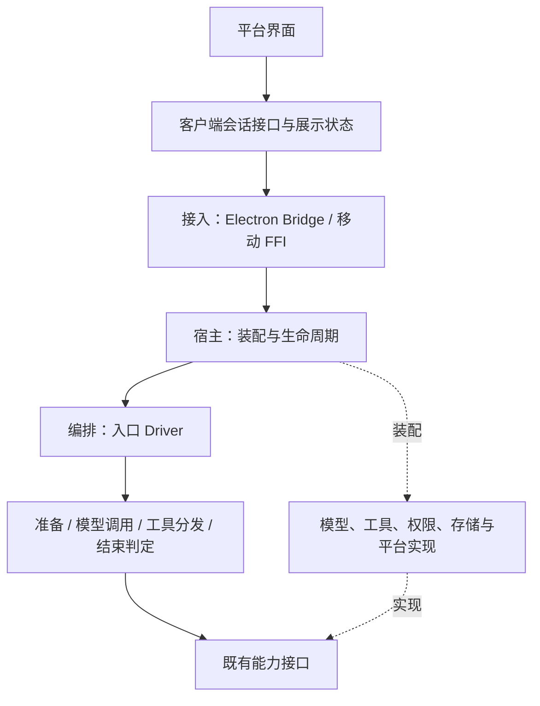

# 主循环与全端模块架构

状态：已修订审查发现的五项设计问题；尚未实施源码迁移，原生全链路验证尚未执行。

## 1. 范围与设计决定

覆盖 Rust orchestrator、移动与桌面宿主、Bridge，以及 Electron、iOS、Android 会话连接链路。保留当前功能、输出、事件顺序、错误映射和资源生命周期；允许重命名内部接口、调整签名、重定位导出，并同步迁移全部仓库内调用方。

不支持旧版本兼容：不保留旧入口转发、兼容别名、双协议解析或迁移期降级路径。已有代码中的 fallback 必须先区分用途：运行时错误恢复仍属于现有功能，不能仅因名称含 legacy/fallback 就删除。协议字段没有因拆模块而改变的必要时，保持现状；确需改变则全端同步迁移。

采用已有 crate 和平台接口，不新增 kernel、通用事件总线、插件框架或跨端统一状态机。独立执行，不新增依赖、测试用例或无关文档。本文是本次框架设计交付物。

## 2. 依赖方向

图中的箭头表示职责上的调用依赖，不表示执行阶段必须串行，也不要求建立同名 crate。事件按第 5.2 节的连接级、回合级及交互通道返回；能力实现不能引用界面、连接管理器或具体宿主。宿主持有具体实现并向编排器注入接口，编排器不能查询全局客户端对象。

## 3. 模块布局与边界

以下为目标布局；同一职责已有文件时直接复用。新增文件必须承载完整职责，不能仅转发一次调用。

| 区域 | 目标模块 | 输入与输出 | 状态所有者 |
|---|---|---|---|
| orchestrator/conversation/drivers | batched.rs | 批量及可取消入口、现有 outcome | 每次调用持有 TurnLoopState |
| 同上 | streaming.rs | 流式入口、事件 sink、现有 outcome | 每次调用持有流式阶段状态 |
| 同上 | input.rs | 排队输入与注入请求 | 复用已有队列，不复制缓存 |
| 同上 | loop_state.rs | 状态构造、guard 与 verdict | TurnLoopState 定义所在地 |
| 同上 | prepare.rs / disposition.rs | 准备与结束判定 | 复用当前实现 |
| orchestrator/turn_loop | model_call.rs / tool_dispatch.rs | 准备好的请求、执行能力、恢复状态或工具执行结果；访问限制见下表 | 原有状态所有者，内部仅借用 |
| engine-mobile/host | assembly.rs | MobileConfig、平台能力 → runtime/handle | 引擎 |
| 同上 | commands.rs | 命令分流 → 对应宿主操作；连接级响应出口 | 不新建回合状态，按第 5.1 节取得锁 |
| 同上 | turn_lifecycle.rs | 提交、取消、暂停、完成通知 | ActiveTurn 与回合槽位 |
| 同上 | listeners.rs | 引擎事件 → 客户端事件 | 既有身份与代次上下文 |
| bridge-server/server | turn_control.rs | 回合开始、取消目标、终态门控 | ActiveTurnControl |
| 同上 | interactions.rs | 权限、问题与工具关联清理 | TurnInteractions |
| bridge-server/server.rs | 连接命令路由与连接释放 | 连接请求 → 宿主/driver | BridgeConnection |

Rust 的 mod.rs/host.rs 仅保留必要类型、模块声明和真实装配职责，不作为旧路径转发桶。移动定义时同步更新调用方；缩小到实际所需的 pub(super)/pub(crate)，避免为跨文件访问把状态全部公开。移除 use super::* 时使用明确导入，不制造反向模块依赖。

### 状态访问与内部接口

拆文件与降低耦合分别验收。当前 `execute_one_turn_with_recovery_tracked`、`dispatch_tool_uses_tracked_deferred` 和 `StreamingTurnDriver` 都依赖完整 `ConversationOrchestrator`；移动这些函数不会自动缩小依赖。

| 模块/操作 | 允许读取与调用的能力 | 可修改的状态与结果提交 | 禁止新增的依赖 |
|---|---|---|---|
| 入口 driver | 配置、输入、准备、模型执行、工具执行、结束判定的现有操作 | 自己的 TurnLoopState、阶段结果；在既有时点提交历史与收尾 | 具体宿主、FFI、窗口或设备实现 |
| prepare / disposition | 现有会话、prompt/model/compaction/lifecycle runtime 及对应操作 | 原有提醒去重、准备和结束副作用；不重复创建状态 | 新的宿主句柄、客户端状态 |
| model_call 的请求执行部分 | 已准备的请求、模型适配器、执行所需取消/输出/计量能力、当前 RecoveryState | 调用结果、原有请求计量与恢复状态；会话切换/压缩仍经原有负责该操作的代码 | 为读取少量字段而接收完整宿主或额外全局对象 |
| tool_dispatch 的执行部分 | ToolRegistry、PermissionGate、HookExecutor、既有工具上下文、取消与进度出口 | 工具自身原有副作用；返回结果和 DeferredToolDispatch 中的消息、modifier、hook 数据；保留现有持久化责任与时点 | 客户端 Runtime、连接管理器；自行释放宿主回合槽位 |
| commands | 命令参数、对应管理/会话/回合操作及连接级响应出口 | 所属命令原有副作用；回合槽位变更交给既有生命周期操作 | 直接改写 ActiveTurn 的取消、完成、终态原子状态 |
| turn_lifecycle / turn_control | 回合身份、取消令牌、任务、owner 槽位、既有交互清理与持久恢复操作 | 接纳、取消、暂停、完成与释放；每次清理保持身份关联 | UI 展示状态、客户端恢复缓存 |
| listeners | 匹配身份、事件分类、下游 listener/sink、原有 durable journal | 原有终态门控、事件序号及恢复快照；不接管回合任务释放 | 一份新的活动回合真相、通用无门控事件出口 |
| assembly | 配置、能力实现与构造函数 | 构造并注入同一份共享状态 | 运行中的第二套命令路由或回合状态机 |

接口收敛采用以下规则：

1. 优先传已有参数和值类型，例如 PreparedTurnStep、RecoveryState、DeferredToolDispatch；不复制 session、预算、owner 或取消令牌的权威状态。同步更新调用方，不保留旧签名转发。
2. 只执行模型请求、转换数据或执行工具的内部函数，参数限定为上表所需能力；不能用一个包含完整 orchestrator 的 context 包装来声称解耦。仅在多个调用点确实共享同一组能力时，才考虑内部借用视图。
3. 明确保留的耦合是现有跨阶段编排：prepare/disposition、需要会话压缩或切换模型的恢复流程、StreamingToolExecutor 的借用生命周期，以及宿主入口的串行化。它们可继续持有原 orchestrator/handle；只移动位置不算降低这些耦合。不能为缩小签名改变 await、锁或事件顺序。
4. 实施前逐项记录受影响入口的实际字段访问，实施后对照参数、字段可见性和调用图。每项必须是“已缩小能力范围”“有上述职责理由的保留”或“无法证明等价，跳过”，不能仅用文件变短或通配导入消失验收。
5. 不通过给所有状态添加 getter/setter 来包装原有耦合。已有负责会话变更、恢复或持久化的操作优先复用；如果仍需完整对象，则明确归入编排操作，禁止让它成为其他模块的任意状态入口。

### Electron

在 src/main 下使用现有命名风格：

- bridge-discovery.ts：路径解析、进程发现、启动配置相关纯逻辑。
- session-runtime-types.ts：确实由 Runtime 与 Manager 共享的类型，不导入两者实现；仅单方使用的类型留在所属模块。
- session-runtime.ts：单个会话的进程、传输、请求关联、事件处理与释放。
- session-runtime-manager.ts：会话 Runtime 集合、窗口绑定、缓存和集合级关闭。
- host.ts：IPC 参数处理与应用操作，调用 Manager/Runtime 明确接口。
- index.ts：应用启动装配；shared/client.ts 继续负责协议传输。

删除 BridgeManager extends SessionRuntime。BridgeManagerOptions 改为 SessionRuntimeOptions；发现逻辑只接收其实际使用的配置类型。index、host、scheduled、session-catalog 和测试直接导入所属模块。迁移完后删除 bridge.ts，不保留兼容 re-export。

运行时依赖为 Manager → Runtime → shared client；Runtime 不反向导入 Manager。回调使用现有明确类型，不增加全局服务定位器。类型边界遵守 ES modules、.js 后缀、显式顶层返回类型和项目导入排序。

### iOS

- ConversationSource.swift：会话契约及其默认实现。
- ConversationModel.swift：展示模型与相关展示类型。
- MockConversationSource.swift：现有模拟实现。
- DurableTurnStore.swift：现有持久回合记录与恢复所需值类型。
- EngineConversationSource.swift：FFI 引擎接入、会话 epoch、提交与恢复编排。
- 引擎监听器与权限 sink 优先整类型移动；若私有可见性要求共置，则与 EngineConversationSource 留在同一文件，不扩大可见性强拆。

保留条件编译边界和 MainActor 隔离。合并两处取消等待流程为同一个私有操作：命令返回 → listener FIFO 空闲 → 关联终态确认 → 完成取消处理；调用点原有展示与日志仍在原位置。

### Android

- ConversationSource.kt：会话契约。
- DurableTurnStore.kt：持久回合数据及存储。
- ConversationRecovery.kt：现有 replay gate、attach coordinator 和取消关联处理。
- ConversationEventRelay.kt：现有 LosslessEventRelay 与相邻事件转交逻辑。
- EngineConversationSource.kt：FFI handle、Flow 发布、提交与生命周期编排。

RootScreen 继续通过 ConversationSource 操作引擎；现有工作区切换事务、Compose effect keys 与闭包捕获不因文件拆分而改变。只移动需要独立理解的完整类型，紧密耦合的私有 helper 随所有者移动。

## 4. 主循环执行契约

保留三个入口和各自循环语义；共享阶段实现，不通过大量策略开关合并成万能循环。

| 入口 | 顶部顺序 | 退出责任 |
|---|---|---|
| 批量 | drain → max_turns → budget → increment | 保留批量 outcome 映射 |
| 可取消批量 | cancel → max_turns → budget → increment；不 drain | 保留 select! 覆盖范围与取消映射 |
| 流式 | drain → max_turns → budget → increment → cancel | 保留流式工具结果和 epilogue |

批量路径的一轮保留 `guard → prepare → 模型响应处理 → 工具执行/结果提交 → ending` 的既有分支；可取消批量入口仍由原有外层 select! 覆盖准备与执行。

流式路径使用不同的时序：

1. guard 与 prepare 后，在消费模型流之前建立 StreamingToolExecutor。模型流 pump 持有对同一 executor 的借用。
2. 流中每个 tool_use 的 content_block_stop 到达时，立即登记工具；未取消时按原队列规则启动。`pump_stream_with_executor_tracked` 并发推进模型流和正在执行的工具，保持现有 select! 分支优先级；不能等 EndOfStream 才执行工具。
3. 流中完成的工具结果保留在 executor 内，不在 pump 中提前写入历史或发出 tool_result。流结束后的正常 finalize 路径先按原顺序处理 assistant 消息，再由 `drive_streaming_tools` 按工具接收顺序收集并提交结果；PostToolBatch 仍在现有判定分支和持久化边界执行。
4. 流错误、重试、fallback、取消和部分完成继续沿原分支处理；有工具已开始执行时不得通过重新调用整个模型阶段重复副作用。取消后的工具登记、合成结果及 Block 工具等待规则保持现状，不用外层 select! 直接丢弃流式执行 future。

`streaming_loop.rs` 负责 pump，`streaming_executor.rs` 负责运行队列与完成缓冲，streaming driver 负责阶段编排和结果提交。这些是已有模块，不另建一套执行器。模型调用与工具分发拆文件时保留它们之间这条有意存在的协作关系。

函数提取保留原 await 位置、锁范围、Drop guard 生命周期和事件发出顺序。准备阶段的现有步骤不重新排序。现有 `streaming_mid_stream_execution_test`、`streaming_mid_stream_tool_test`、`streaming_concurrent_tools_test`、`streaming_frame_order_test` 是此边界的指定回归。

TurnLoopState 每次入口调用新建，不能提升到 session/runtime。模型调用与恢复模块不拥有第二份回合计数或预算。StepExit 的 Continue、FinishThroughEpilogue、ReturnDirect 保持区分；流式 Complete 和 ForcedComplete 的末尾输入消费差异也保留。

## 5. 状态归属与跨模块连接契约

| 生命周期 | 权威所有者 | 释放或变更依据 |
|---|---|---|
| 引擎 | 宿主 runtime/handle | 显式关闭、宿主销毁 |
| 连接 | BridgeConnection / 平台接入对象 | 当前连接身份确认后的断开 |
| 会话 | SessionRuntime / EngineConversationSource | 会话切换与对应恢复状态 |
| 执行回合 | 宿主 ActiveTurn；内部计算由 TurnLoopState 持有 | 实际执行完成；终态通知不自动等于任务释放 |
| 持久回合 | Rust 宿主的 DurableTurnStore | 现有 durable 状态迁移与终态；没有活动 executor 的暂停/等待回合仍可被关联取消 |
| 客户端恢复索引 | iOS/Android 的客户端 durable store 与既有接管协调器 | 保存恢复身份与游标；不能代替 Rust 的执行状态或终态确认 |
| 展示投影 | ConversationModel / 客户端状态 | 接收匹配身份的事件，不接管引擎所有权 |
| 交互请求 | 现有权限、问题等 broker | 请求响应或所属生命周期关闭 |
| 音频 | 现有连接/会话音频服务 | 音频完成、显式取消或所属连接释放 |

连接、会话、回合标识继续使用现有类型，不新增统一 SessionContext 大对象。模块只接收它需要的标识和能力。客户端投影和宿主执行状态可以同时存在，但不得互相冒充权威状态。

关键路径：

1. 提交：客户端建立现有监听/关联 → 宿主按现有锁顺序接纳回合 → driver 执行 → 事件带现有身份返回。
2. 取消：关联当前 owner → 释放该次读取 owner 所用的短期锁 → 请求取消并按对应宿主的原流程等待/清理。移动 submit 的 transition 与 cron session guard 保持到该命令完成，不能与 owner 短期锁一起提前释放。客户端仍等待原有终态确认；各宿主具体规则见第 5.1 节。
3. 暂停：先标记 quiescing，再取消执行；保留暂停与用户取消不同的终态规则。
4. 恢复：通过现有 durable 记录、epoch 与接管门控恢复，不因换模块重复启动回合。
5. 断连：保留身份检查、停止生产者、等待任务与清理响应器的原顺序；异步 close 和 Drop 不合并。
6. 迟到事件：在修改状态之前执行现有 generation/epoch/turn 校验。终态已发出与任务已释放是两个事实，不能合并为一个布尔值。

### 5.1 命令、锁与旁路

下表固定当前实现，不为拆模块重新设计锁协议。commands 负责选择入口，生命周期操作保留原锁范围；锁不能因为函数移动而延长，也不能提前释放。

| 路径 | 取得/绕过哪些锁 | 持有范围与完成条件 |
|---|---|---|
| 移动 `submit(AnswerAskUserQuestion / CancelAskUserQuestion)` | 在 submit 直接解析 broker 请求，绕过 submit_impl 的 loop_transition 与 cron session gate | 仅保留 broker 自身现有同步；问卷可能由持有 transition 的工作流发出，不能等待同一把锁 |
| 移动 submit 的其余命令，包括 SendPrompt、Cancel、PauseTurn、AttachTurn、权限响应和会话变更 | 先 loop_transition，再按原规则选择的 mobile_cron_session_gate；保留锁间原有查询和 scheduler 操作 | 两个 guard 均由 submit_impl 持有直到命令处理返回；不把取消或权限响应误改成新增旁路 |
| 移动活跃回合取消/暂停 | 在上述命令锁内短暂取得 active_cancel，克隆匹配 owner 后释放此 owner 锁；后续状态更新保留原局部锁 | 取消等待 wait_for_turn_release；暂停先 request_quiesce 再等待。不能持有 active_cancel 等待任务结束，因为任务收尾也需要该锁 |
| 移动无活动 executor 的特定 turn 取消 | 重新取得 active_cancel，确认仍为空，再按当前 session/turn 更新 durable store | 保持原临界区；不能用最初的空槽位快照取消后来接纳的回合 |
| 移动 resume_empty_session、定时 wakeup 与会话接纳 | 保留各自已有 loop_transition/gate 路径及重检查；不为内部方法再套一层同一把锁 | 内部被锁包围的调用不能重新取得同一个非重入 gate；保留 wakeup 在繁忙时放锁再等待的行为 |
| Bridge 回合取消 | cancellation_target 在短期 owner mutex 内取得 generation/token，返回时释放；不引入移动端的 transition 锁 | 保留后台任务处理后 cancel 的顺序；await 后再次核对 generation，才清理匹配 owner 的交互。此路径不改成移动端式等待任务释放 |

移动端 `submit` 中对其余命令的 Box::pin 也保留：它限制大型异步分发 future 的栈占用，并非可随手删除的包装。ActiveTurn 的“先注册 notified，再次检查 completed”顺序保持不变，避免漏唤醒。

指定现有回归包括 `submit_question_answer_bypasses_a_held_transition_lock`、`submit_cancel_waits_for_cleanup_before_new_session`、`submit_cancel_waits_for_blocking_owner_to_finish`、`submit_pause_waits_for_owner_and_publishes_paused_without_cancelled`、`stale_specific_cancel_does_not_touch_current_turn` 及 inactive durable cancel 测试。移动宿主测试必须启用 uniffi，不能以默认 feature 下未编译 host 的结果替代。

### 5.2 事件出口、过滤与记录

路由按事件来源和生命周期决定，不能只看 ClientEvent 枚举变体。模块拆分不统一移动端与 Bridge 现有的事件分类差异。

| 事件来源 | 移动端出口 | Bridge 出口 | 过滤、序号和记录责任 |
|---|---|---|---|
| driver/工具产生的回合正文、工具结果、回合终态 | 原 event_sink → TurnLifecycleListener → 外部 listener | 原受 ActiveTurnControl 门控的 event_sink | 保留 owner、quiescing、终态去重规则；移动端仅按 is_turn_journal_event 写 durable journal。终态发出不释放执行槽位 |
| 命令处理产生的连接级响应，例如空闲时的设置确认 SystemNotice | 原 connection_sink | 私有 unscoped_event_sink | 不受活跃回合限制，不写入回合 transcript journal；不得将此无门控出口注入 orchestrator |
| 回合之间的 wakeup 通知 | 既有连接/调度通知路径 | 现有 loop_wakeup_event_sink 窄接口 | 通知可在无活跃回合时发送；调度真正开始执行后的回合输出仍走受控出口 |
| AskUserQuestion、权限与其他交互请求 | 保留既有 broker、PermissionRequestSink 及请求关联；AskUserQuestion 继续经过原 listener 分类 | 保留现有专用 sink/broker 和 accepts_interactions 检查 | 不套用通用文本事件过滤；移动 AskUserQuestion 可属于连接级后台工作流，不能随当前回合结束清空；匹配回合时仍保留原恢复状态更新 |
| Attach/replay 与 TurnRecoveryState | 保留 durable store → 现有 listener 的关联与重放路径 | 沿已有协议处理 | 不为重放再分配一份原始事件序号，不把恢复事件重新当作普通回合正文记录 |
| 音频请求/响应/取消 | 既有 NativeAudioService callback | 既有 audio bridge/responder | 保留音频 identity 与代次检查及连接清理；不纳入通用回合事件清空逻辑 |

同一个 SystemNotice：由回合产生时必须通过回合门控，由连接级命令产生时必须通过连接出口。listeners 仅持有自己所需的下游出口和状态；commands 不获得修改终态 latch 的权限，driver 不获得 connection_sink/unscoped_event_sink。

移动 durable journal 不能成为 live 事件投递的前置成功条件：保留现有“记录失败仍向客户端投递已接受事件”的路径。原本不属于回合的事件不能消耗有界 replay 缓冲。客户端既有 session/epoch/generation 过滤仍保留，不因宿主过滤而删除。

指定现有回归包括 `lifecycle_listener_drops_unowned_live_payloads_but_forwards_questions`、`lifecycle_listener_keeps_connection_scoped_events_out_of_the_turn_journal`、`lifecycle_listener_delivers_terminal_event_the_journal_refuses`，以及 Bridge 的 `terminal_closes_all_turn_events_without_releasing_the_driver_slot`。

## 6. 实施顺序

每批先保存该批变更前的工作区差异用于对照，保留已有未提交工作；不重置、暂存或提交用户改动。

1. Rust drivers：先按状态访问表界定保留的编排操作与可缩小参数的内部函数，再移动驱动/状态和处理模型/工具模块；保留 ExecutorPump 协作，同步源码定位型测试，运行指定时序回归。
2. Rust 宿主：先按第 5.1、5.2 节标定锁和事件出口，再分离装配、命令、回合生命周期和监听器；桥接沿既有类型边界分离，验证各特性编译及指定宿主回归。
3. Electron：先抽离叶子配置/类型，再 Runtime，再 Manager；一次更新全部调用方并删除旧别名与入口。
4. iOS：整类型迁移并收敛重复取消等待；保留条件编译、actor 与 FIFO；从当前 Rust 源码重建匹配的绑定/框架，运行 Xcode 与实际 FFI 回归后进入 Android。
5. Android：整类型迁移，检查订阅、恢复和销毁顺序；从当前 Rust 源码分别重建 Direct/Play JNI，完成第 7 节的静态与设备端验证。
6. 全链路检查：无旧路径调用、循环依赖、重复状态所有者或遗留兼容包装；按状态访问表报告实际缩小的依赖和有意保留的耦合。

不顺带修改协议、UI 或业务错误恢复，也不手工修改生成绑定。使用仓库脚本从当前源码重建库与配套绑定是验证的必要步骤，不受这条限制阻止。跨文件迁移要求更新工程文件时同步更新。测试只调整必要的导入和源码定位，不新增测试或放松现有断言；没有现成保护且无法证明等价的简化跳过。

## 7. 验证门槛与证据

已取得的变更前基线：Rust 主循环边界测试 10/10；Electron bridge/host/useBridge 测试 158/158；Electron node/web 与 shared 类型检查通过；88 个 Rust crate 的依赖方向检查通过。此次审查另外运行了 `streaming_mid_stream_execution_test` 和 `streaming_mid_stream_tool_test`，2/2 通过。这些都是改动前的证据，不代表本设计已经实施或全端已验证。

| 区域 | 实施后验证 |
|---|---|
| Rust | orchestrator 现有回归，含第 4 节的流式指定测试；第 5 节的宿主与桥接指定测试；移动 uniffi 及 uniffi + android-computer-use 检查；受影响包 Clippy、格式与依赖方向检查 |
| Electron/shared | node/web 实际项目 typecheck、shared typecheck、相关现有测试与配置的静态检查；不能使用 files: [] 的根 tsconfig 代替 |
| iOS | 先重建当前 Rust 的 XCFramework 和配套绑定，再运行 Xcode 编译及已有恢复、取消、引擎往返和音频生命周期测试；检查实际 FFI 测试被发现并执行 |
| Android | 分别重建 Direct/Play 的 JNI 与匹配绑定；两种变体均通过 debug 编译、单元测试、lint，以及既有设备/模拟器 androidTest |
| 结构 | 全仓引用检查、导出/协议差异审查、源码断言覆盖迁移后的真实文件；逐项核对第 3 节状态访问限制，不能仅凭 crate 依赖检查宣告内部解耦 |

### 7.1 原生产物必须来自待验收源码

Xcode 链接 `apps/ios/native/Frameworks/LingxiCodeFFI.xcframework`，Gradle 从 `app/src/<play|direct>/jniLibs` 打包 Rust 库；普通客户端构建不会自动重编 Rust。原生验证固定为以下依赖顺序，任何一步未完成，后续结果不能算作整条链路通过：

1. 记录当前待验收源码指纹，包含影响构建的未提交与未跟踪文件、Cargo.lock、构建脚本及 feature/target；只记 HEAD 不足以标识当前脏工作区。
2. 从该源码通过仓库现有脚本构建库、头文件和生成绑定，记录退出码、构建日志、输出路径与 SHA-256。成套产物成功后才能用于客户端构建，不能把新绑定与旧库混用。构建输入在过程中改变时，重新构建受影响产物。
3. 确认客户端配置指向此次产物：iOS 核对 Xcode 链接记录中的 framework 路径和目标 slice；Android 核对最终 APK 中目标 ABI 的 libandroid_aar.so 与此次打包输入对应。不能仅凭文件存在或修改时间认定新产物已被使用。
4. 使用本次构建的 app/test runner 安装并运行既有端到端测试，保留 XCTest result bundle 或 Android instrumentation 结果及实际执行数量。未发现、条件编译排除、跳过或仅运行 mock 的测试不计为 FFI 验证通过。

生成绑定与库是同一构建契约，允许由现有脚本再生成；不手改绑定来掩盖接口不匹配，也不把生成文件提交进本来忽略这些产物的目录。

### 7.2 iOS 执行矩阵

- 完整原生产物使用 `bash apps/ios/native/scripts/build-xcframework.sh`（仓库根目录）。本机仅做 Apple Silicon 模拟器验证时可使用 `LINGXI_SIM_ARM64_ONLY=1`，必须将证据标为 simulator-only；这不能代表设备 slice 已构建或通过。
- 脚本支持 LINGXI_GENERATED_DIR、LINGXI_FRAMEWORKS_DIR、LINGXI_XCFRAMEWORK_BUILD_DIR，用于隔离生成。使用隔离路径时，先验证绑定/框架成套成功，再成套用于目标工程；不能让 Xcode 仍链接默认目录的旧库。
- 源文件拆分后从 `apps/ios/native` 运行 `xcodegen generate`，核对 Sources/Generated/framework 引用。用独立 DerivedData 构建，避免旧链接结果混入验收。
- 使用本机实际可用的模拟器 UDID，运行项目 `LingxiCode.xcodeproj` 的 `LingxiCodeStore / StoreDebug` 和 `LingxiCodeFull / FullDebug` 构建及相关测试；沿用 scheme 的 zh-Hans 测试语言。不能使用未安装的固定设备名称作为默认前提。
- 至少包含现有 EngineRoundtripTests、SessionResumeTests、ConversationTurnCompletionTests、IOSAudioServiceTests，以及此次变更触及的会话恢复/监听器测试。核对 FFI 条件编译实际启用和测试数量，保留每个 scheme 的结果文件；模拟器未覆盖的设备专属行为单独报告。

### 7.3 Android 执行矩阵

每种变体各自完成“原生构建 → 客户端构建 → 安装测试”的链路；下列 Gradle 命令从 `apps/android/native` 执行，JNI 脚本从仓库根目录执行：

| 变体 | 原生产物 | 编译、单测与静态检查 | 设备/模拟器测试 |
|---|---|---|---|
| Play | `bash apps/android/native/scripts/build-jni.sh --variant play` | `./gradlew :app:assemblePlayDebug :app:testPlayDebugUnitTest :app:lintPlayDebug` | `./gradlew :app:connectedPlayDebugAndroidTest` |
| Direct | `bash apps/android/native/scripts/build-jni.sh --variant direct` | `./gradlew :app:assembleDirectDebug :app:testDirectDebugUnitTest :app:lintDirectDebug` | `./gradlew :app:connectedDirectDebugAndroidTest` |

脚本分别构建 arm64-v8a 与 x86_64；Direct 启用 android-computer-use，Play 不启用。记录两种变体产物及被测试设备的 ABI。生成 Kotlin 路径由两种变体共用，因此顺序执行并核对绑定与各自库匹配，不能假设最后生成的一份天然适用于所有变体。脚本的 LINGXI_ANDROID_JNILIBS_DIR / LINGXI_KOTLIN_OUT 可用于隔离完整产物，之后仍需核对真实 Gradle 输入。

设备端至少执行现有 `com.lingxi.code.EngineRoundtripTest`（无密钥提交终态、模型列表）与 `com.lingxi.code.conversation.NativeAdminEngineRoundtripTest`，以及受影响的恢复、通知路由等现有测试。JVM 单测不执行真实 EngineConversationSource/FFI 路径，不能代替 androidTest；编译 test APK 也不等于运行测试。设备、模拟器或构建依赖不可用时记录该门槛未完成，不能退化为单测通过后宣告全端完成。

### 7.4 审查问题与验收对应

| 审查项 | 已修订契约 | 实施后必须提供的证据 |
|---|---|---|
| R1：流式时序 | 第 4 节分开批量与流式；保留 ExecutorPump、并发执行与延后提交 | 指定流式回归通过，pump/提交边界对照 |
| R2：原生验证缺口 | 第 7.1–7.3 节建立源码、产物、实际加载与设备端测试链路 | 构建日志、产物身份、实际执行的原生测试结果 |
| R3：仅拆文件未解耦 | 第 3 节列出能力与状态访问约束，并标明保留的跨阶段耦合 | 入口参数/字段可见性/调用关系对照，具体依赖缩小或保留理由 |
| R4：锁与旁路含糊 | 第 5.1 节区分 owner 短锁、transition/session guard 与问卷旁路 | 指定取消、暂停、问卷锁回归通过 |
| R5：事件出口含糊 | 第 5.2 节按来源划分出口、过滤、journal 与交互责任 | 指定 listener/Bridge 回归通过，出口注入与调用点对照 |

按已确认的诊断方式使用 TypeScript 编译器、Cargo/Clippy、Xcode 和 Gradle。当前未取得可用的原生 lsp_diagnostics 工具，不把原生编译检查写成 LSP 执行结果。最终报告逐文件归属诊断结果，要求零类型错误、零新增警告；既有 permission dead_code 等警告单列。

## 8. 设计取舍

- 不新建统一运行内核：已有 orchestrator 已承载公共阶段，再建一层只会增加转接。
- 不合并所有宿主回合控制：Bridge 的连接终态门控与移动端暂停/恢复责任不同。
- 不要求所有文件拆小：不能降低认知负担、反而扩大状态可见性的拆分不做。
- 不保留兼容门面：本次全仓迁移直接更新调用方，旧版本支持不是目标。
- 不将客户端状态全部迁入 Rust：平台展示、actor/Flow 和恢复接入仍由各端负责，核心执行状态留在宿主与编排器。
