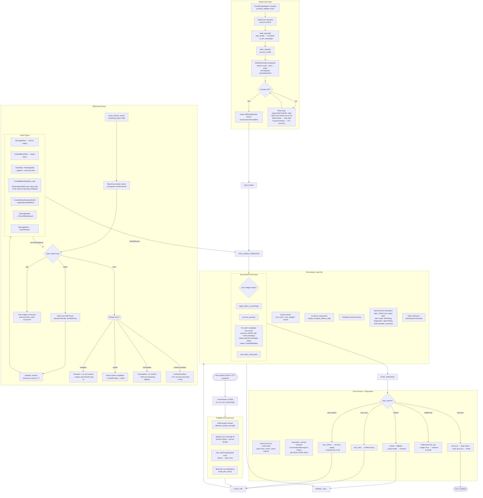
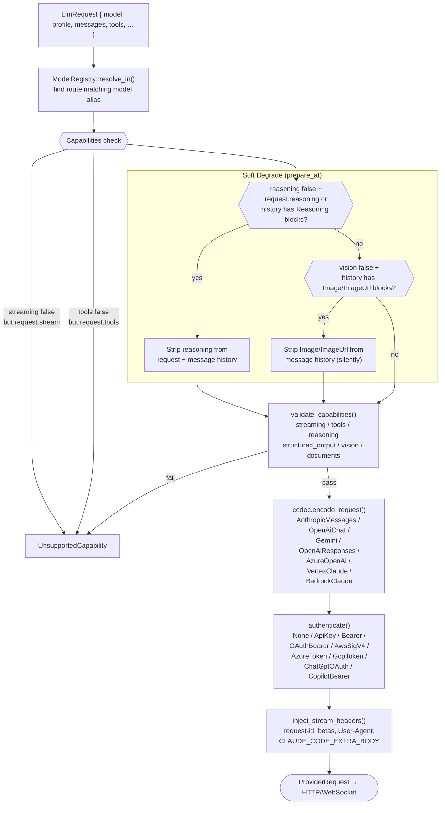
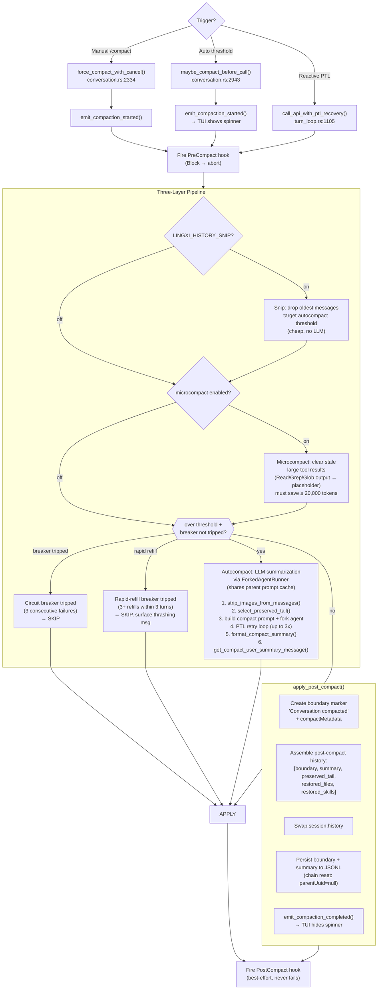
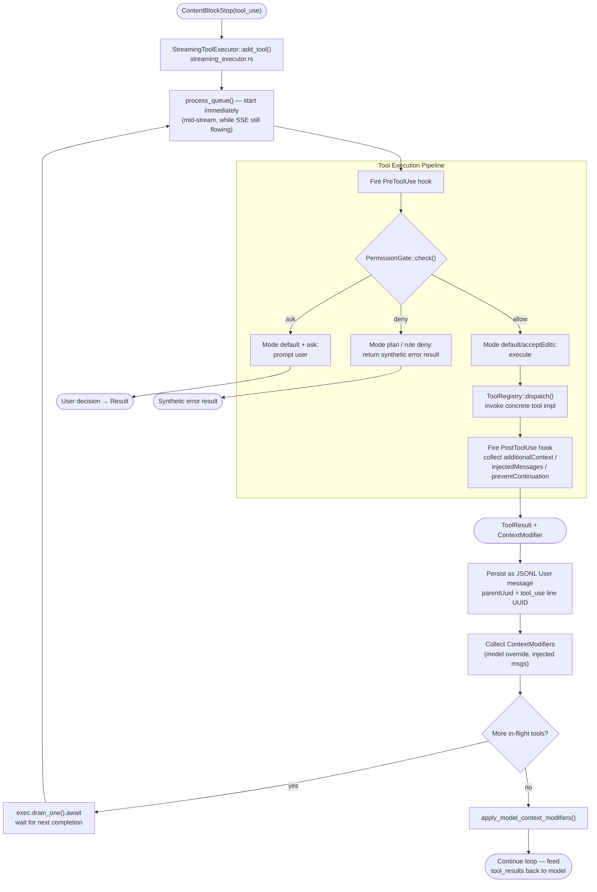
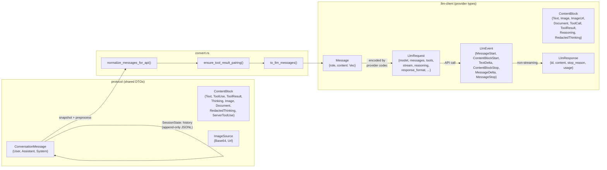
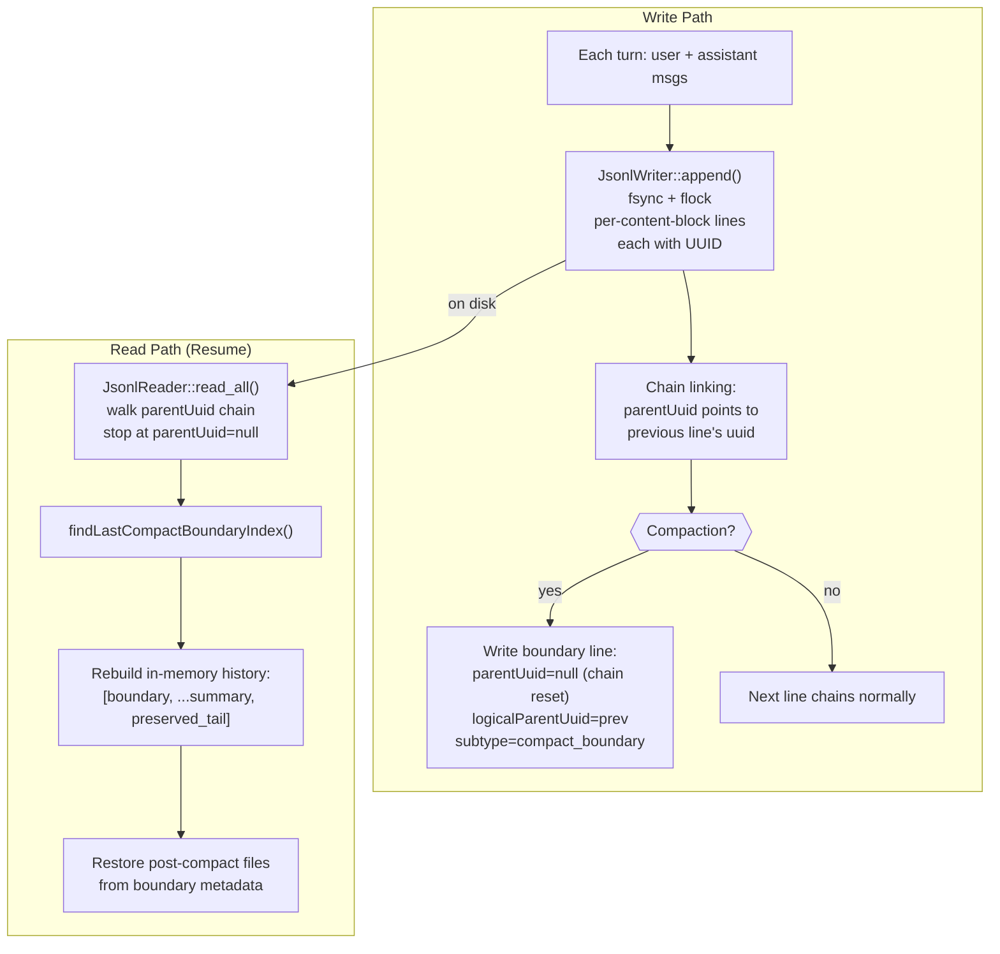

# LingXi Architecture Flowcharts

## 1. Crate Dependency Layers (Inverted Pyramid)

```mermaid
graph TD
    subgraph Layer6["Layer 6: Composition Roots"]
        cli["apps/cli"]
        desktop["apps/engine-desktop"]
        mobile["apps/engine-mobile"]
        bridge["apps/bridge-server"]
        tui["tui"]
        tui_core["tui-core"]
    end

    subgraph Layer5["Layer 5: Platform Adapters"]
        posix["platforms/posix"]
        windows["platforms/windows"]
        ios["platforms/ios"]
        android["platforms/android"]
    end

    subgraph Layer4["Layer 4: Tool Implementations"]
        t_file["tools/file"]
        t_shell["tools/shell"]
        t_web["tools/web"]
        t_agent["tools/agent"]
        t_lsp["tools/lsp"]
        t_mcp["tools/mcp"]
        t_skill["tools/skill"]
        t_worktree["tools/worktree"]
        t_plan["tools/plan"]
        t_task["tools/task"]
        t_meta["tools/meta"]
        t_cron["tools/cron"]
        t_ui["tools/ui"]
        t_team["tools/team"]
        t_workflow["tools/workflow"]
        t_mobile["tools/mobile"]
        t_computer["tools/computer-use"]
        t_android["tools/android-use"]
        t_ios["tools/ios-use"]
    end

    subgraph Layer3["Layer 3: Engine Libraries"]
        orch["orchestrator"]
        llm["llm-client"]
        compact["compaction"]
        agent["agent"]
        session["session"]
        memory["memory"]
        hooks["hooks"]
        perm["permission"]
        cost["cost"]
        telemetry["telemetry"]
        mcp_lib["mcp"]
        sidequery["sidequery"]
        coord["coordinator"]
        wf["workflow"]
        fusion["fusion"]
    end

    subgraph Layer2["Layer 2: Abstraction"]
        platform_api["platform-api"]
        tool_api["tool-api"]
        skill_api["skill-api"]
        command_api["command-api"]
    end

    subgraph Layer1["Layer 1: Foundation"]
        proto["protocol"]
        core_crate["core"]
        branding["branding"]
    end

    Layer6 --> Layer5
    Layer5 --> Layer4
    Layer4 --> Layer3
    Layer3 --> Layer2
    Layer2 --> Layer1
```

## 2. Main Loop Flow (Streaming Path — TUI)

## 3. Provider / Model Resolution Chain

## 4. Compaction Pipeline

## 5. Tool Execution Flow

## 6. Data Type Relationships

## 7. Session Persistence (JSONL)

## 8. Key File Map

| File | Purpose |
|---|---|
| `orchestrator/src/conversation.rs:5545` | `try_run_turn_streaming` — main streaming turn loop |
| `orchestrator/src/conversation.rs:2334` | `force_compact_with_cancel` — manual /compact handler |
| `orchestrator/src/conversation.rs:2592` | `apply_post_compact` — post-compact history swap |
| `orchestrator/src/conversation.rs:2943` | `maybe_compact_before_call` — proactive auto-compact |
| `orchestrator/src/turn_loop.rs:1105` | `call_api_with_ptl_recovery` — reactive 413 recovery |
| `orchestrator/src/streaming_loop.rs:381` | `pump_stream_inner` — SSE event pump core |
| `orchestrator/src/sse/event_router.rs:77` | `dispatch_event` — SSE event → RouterAction |
| `orchestrator/src/streaming_executor.rs` | `StreamingToolExecutor` — mid-stream tool execution |
| `orchestrator/src/provider_adapter.rs:542` | `ProviderApiAdapter::stream` — main-loop adapter |
| `llm-client/src/service.rs:2284` | `ApiService::drive_stream` — retry loop + connect |
| `llm-client/src/service.rs:809` | `ApiService::build_request` — message preprocessing |
| `llm-client/src/client.rs:283` | `DefaultLlmClient::prepare_at` — resolve + validate + degrade |
| `llm-client/src/protocol.rs:838` | `validate_capabilities` — capability enforcement |
| `llm-client/src/convert.rs:41` | `to_llm_messages` — protocol → llm-client bridge |
| `compaction/src/orchestrator.rs:185` | `process_iteration_tracked` — snip/micro/auto pipeline |
| `compaction/src/autocompact.rs:162` | `Autocompactor::compact` — LLM summarization |
| `compaction/src/boundary.rs:157` | `create_compact_boundary` — boundary marker |
| `tui/src/files.rs:29` | `file_completions` — @file autocomplete |
| `tui/src/composer.rs:230` | `at_fragment` — detect @ token in composer |
| `session/src/jsonl/writer.rs` | `JsonlWriter` — append-only JSONL persistence |
